# 🏗️ ARQUITECTURA BIM REAL - SISTEMA NACIONAL CALE

**Basado en:** INFORME_FINAL_56_NODOS_ESPECIFICACIONES_COMPLETAS.md
**Fecha:** 2025-10-23
**Versión:** 2.0 (CORREGIDA - Basada en datos reales)

---

## 📊 ANÁLISIS DE CONFIGURACIONES REALES

### Configuraciones Cat.A Utilizadas (6 tipos)

| Config | Cantidad | Municipios | Componentes |
|--------|----------|------------|-------------|
| **Cat.A** | 2 | Barrancabermeja, Buenaventura | T-24q + P-C3 |
| **Cat.A+C1** | 11 | Pasto, Valledupar, Medellín, etc. | T-24q + P-C3 + 2×P-C1 |
| **Cat.A+C2+C1** | 2 | Bucaramanga, Ibagué | T-24q + P-C3 + P-C2 + 2×P-C1 |
| **Cat.A+C2+C1\*\*\*** | 2 | Mosquera, Cúcuta | T-24q + P-C3 + P-C2 + 3×P-C1 |
| **Cat.A+C2+C1\*\*\*\*** | 3 | Bogotá Sur, Bogotá Norte, Cali | T-24q + P-C3 + P-C2 + 4×P-C1 |

**Total:** 5 configuraciones únicas (no 12)

### Configuraciones Cat.B Utilizadas (2 tipos)

| Config | Cantidad | Descripción | Componentes |
|--------|----------|-------------|-------------|
| **Cat.B** | 4 | Solo teórico | T-16q |
| **Cat.B\*\*** | 16 | Con pistas | T-16q + P-C2 + 2×P-C1 |

**Total:** 2 configuraciones únicas

### Configuraciones Cat.C1 Utilizadas (1 tipo)

| Config | Cantidad | Descripción | Componentes |
|--------|----------|-------------|-------------|
| **Cat.C1** | 16 | Evaluación C1 | T-8q + P-C1 |

**Total:** 1 configuración única

### Configuraciones Satélites (4 tipos)

| Config | Cantidad | Demanda | Componentes |
|--------|----------|---------|-------------|
| **Cat.C2** | 50 | 3K-7.5K | T-4q |
| **Cat.C3** | 45 | 1.5K-3K | T-2q |
| **Cat.C4** | 30 | 800-1.5K | T-2q (básico) |
| **Cat.C5** | 16 | 300-800 | T-2q (mínimo) |

**Total:** 4 configuraciones únicas

---

## 🎯 ARQUITECTURA SIMPLIFICADA: COMPOSICIÓN JERÁRQUICA

```
NIVEL 0: PRIMITIVAS GEOMÉTRICAS (FreeCAD)
  └─ Box, Cylinder, Boolean operations

NIVEL 1: COMPONENTES ATÓMICOS (Building Blocks)
  ├─ Cubículo (1.2×0.8×1.6m)
  ├─ Carril (3.5m ancho)
  └─ Módulo contenedor (ISO 20'/40')

NIVEL 2: COMPONENTES FUNCIONALES (Ensamblajes de Nivel 1)
  ├─ Sala T-24q (24 cubículos)
  ├─ Sala T-16q (16 cubículos)
  ├─ Sala T-8q (8 cubículos)
  ├─ Sala T-4q (4 cubículos)
  ├─ Sala T-2q (2 cubículos)
  ├─ Pista P-C3 (pesados)
  ├─ Pista P-C2 (medianos)
  ├─ Pista P-C1 (livianos)
  ├─ Datacenter DC-001
  ├─ Área administrativa ADM-001
  └─ Servicios SERV-001

NIVEL 3: CONFIGURACIONES DE NODOS (Ensamblajes de Nivel 2)
  ├─ Cat.A (5 variantes)
  ├─ Cat.B (2 variantes)
  ├─ Cat.C1 (1 variante)
  └─ Satélites (4 variantes)

NIVEL 4: RED NACIONAL (Ensamblajes de Nivel 3)
  └─ 197 nodos totales
```

---

## 📐 DIAGRAMA MERMAID COMPLETO

```mermaid
graph TB
    %% NIVEL 0: PRIMITIVAS
    subgraph NIVEL0["🔷 NIVEL 0: PRIMITIVAS GEOMÉTRICAS"]
        BOX["Box<br/>Cubo paramétrico"]
        CYL["Cylinder<br/>Cilindro paramétrico"]
        BOOL["Boolean Ops<br/>Unión, resta, intersección"]
    end

    %% NIVEL 1: COMPONENTES ATÓMICOS
    subgraph NIVEL1["🔶 NIVEL 1: COMPONENTES ATÓMICOS"]
        CUB["Cubículo<br/>1.2×0.8×1.6m<br/>$2.25M"]
        CARR["Carril<br/>3.5m × variable<br/>$850K/m²"]
        MOD20["Contenedor 20'<br/>6.1×2.4×2.6m<br/>$40M"]
        MOD40["Contenedor 40'HC<br/>12.2×2.4×2.9m<br/>$80M"]
    end

    %% NIVEL 2: COMPONENTES FUNCIONALES
    subgraph NIVEL2["🔸 NIVEL 2: COMPONENTES FUNCIONALES"]

        subgraph TEORICOS["📚 Componentes Teóricos"]
            T24["Sala T-24q<br/>24 cubículos<br/>240m²<br/>$54M"]
            T16["Sala T-16q<br/>16 cubículos<br/>160m²<br/>$36M"]
            T8["Sala T-8q<br/>8 cubículos<br/>80m²<br/>$18M"]
            T4["Sala T-4q<br/>4 cubículos<br/>40m²<br/>$9M"]
            T2["Sala T-2q<br/>2 cubículos<br/>20m²<br/>$4.5M"]
        end

        subgraph PISTAS["🏁 Componentes Pistas"]
            PC3["Pista P-C3<br/>Pesados >10.5t<br/>3,236m²<br/>$2,500M"]
            PC2["Pista P-C2<br/>Medianos 3.5-10.5t<br/>2,100m²<br/>$1,600M"]
            PC1["Pista P-C1<br/>Livianos <3.5t<br/>1,500m²<br/>$1,200M"]
        end

        subgraph INFRA["🏢 Infraestructura"]
            DC["Datacenter DC-001<br/>40m²<br/>$17.98M"]
            ADM["Admin ADM-001<br/>120m²<br/>$45M"]
            SERV["Servicios SERV-001<br/>80m²<br/>$25M"]
            SEG["Seguridad SEG-001<br/>30m²<br/>$12M"]
        end
    end

    %% NIVEL 3: CONFIGURACIONES DE NODOS
    subgraph NIVEL3["🔺 NIVEL 3: CONFIGURACIONES DE NODOS"]

        subgraph CATA["🅰️ Cat.A - 20 Nodos Metropolitanos"]
            CAT_A["Cat.A<br/>2 nodos<br/>$243M"]
            CAT_A_C1["Cat.A+C1<br/>11 nodos<br/>$243M"]
            CAT_A_C2_C1["Cat.A+C2+C1<br/>2 nodos<br/>$243M"]
            CAT_A_C2_C1_3["Cat.A+C2+C1***<br/>2 nodos<br/>$243M"]
            CAT_A_C2_C1_4["Cat.A+C2+C1****<br/>3 nodos<br/>$243M"]
        end

        subgraph CATB["🅱️ Cat.B - 20 Nodos Subregionales"]
            CAT_B["Cat.B<br/>4 nodos<br/>$196M"]
            CAT_B_PISTAS["Cat.B**<br/>16 nodos<br/>$196M"]
        end

        subgraph CATC1["🅲 Cat.C1 - 16 Nodos Micro-regionales"]
            CAT_C1["Cat.C1<br/>16 nodos<br/>$120M"]
        end

        subgraph SATEL["🛰️ Satélites - 141 Nodos"]
            CAT_C2["Cat.C2<br/>50 nodos<br/>$12M"]
            CAT_C3["Cat.C3<br/>45 nodos<br/>$12M"]
            CAT_C4["Cat.C4<br/>30 nodos<br/>$12M"]
            CAT_C5["Cat.C5<br/>16 nodos<br/>$12M"]
        end
    end

    %% NIVEL 4: RED NACIONAL
    subgraph NIVEL4["⭐ NIVEL 4: RED NACIONAL"]
        RED["SNCALE<br/>197 Nodos<br/>$12,392M CAPEX<br/>$164,250M OPEX/año<br/>1,555,421 eval/año"]
    end

    %% RELACIONES NIVEL 0 → NIVEL 1
    BOX --> CUB
    BOX --> MOD20
    BOX --> MOD40
    CYL --> CARR
    BOOL --> CUB
    BOOL --> CARR

    %% RELACIONES NIVEL 1 → NIVEL 2 (Teóricos)
    CUB -->|×24| T24
    CUB -->|×16| T16
    CUB -->|×8| T8
    CUB -->|×4| T4
    CUB -->|×2| T2

    %% RELACIONES NIVEL 1 → NIVEL 2 (Pistas)
    CARR -->|Configuración C3| PC3
    CARR -->|Configuración C2| PC2
    CARR -->|Configuración C1| PC1

    %% RELACIONES NIVEL 1 → NIVEL 2 (Infraestructura)
    BOX --> DC
    BOX --> ADM
    BOX --> SERV
    BOX --> SEG

    %% RELACIONES NIVEL 2 → NIVEL 3 (Cat.A)
    T24 --> CAT_A
    PC3 --> CAT_A
    DC --> CAT_A
    ADM --> CAT_A
    SERV --> CAT_A

    T24 --> CAT_A_C1
    PC3 --> CAT_A_C1
    PC1 -->|×2| CAT_A_C1
    DC --> CAT_A_C1
    ADM --> CAT_A_C1

    T24 --> CAT_A_C2_C1
    PC3 --> CAT_A_C2_C1
    PC2 --> CAT_A_C2_C1
    PC1 -->|×2| CAT_A_C2_C1
    DC --> CAT_A_C2_C1

    T24 --> CAT_A_C2_C1_3
    PC3 --> CAT_A_C2_C1_3
    PC2 --> CAT_A_C2_C1_3
    PC1 -->|×3| CAT_A_C2_C1_3
    DC --> CAT_A_C2_C1_3

    T24 --> CAT_A_C2_C1_4
    PC3 --> CAT_A_C2_C1_4
    PC2 --> CAT_A_C2_C1_4
    PC1 -->|×4| CAT_A_C2_C1_4
    DC --> CAT_A_C2_C1_4

    %% RELACIONES NIVEL 2 → NIVEL 3 (Cat.B)
    T16 --> CAT_B
    ADM --> CAT_B

    T16 --> CAT_B_PISTAS
    PC2 --> CAT_B_PISTAS
    PC1 -->|×2| CAT_B_PISTAS
    MOD40 --> CAT_B_PISTAS

    %% RELACIONES NIVEL 2 → NIVEL 3 (Cat.C1)
    T8 --> CAT_C1
    PC1 --> CAT_C1
    MOD20 --> CAT_C1

    %% RELACIONES NIVEL 2 → NIVEL 3 (Satélites)
    T4 --> CAT_C2
    T2 --> CAT_C3
    T2 --> CAT_C4
    T2 --> CAT_C5

    %% RELACIONES NIVEL 3 → NIVEL 4
    CAT_A -->|×2| RED
    CAT_A_C1 -->|×11| RED
    CAT_A_C2_C1 -->|×2| RED
    CAT_A_C2_C1_3 -->|×2| RED
    CAT_A_C2_C1_4 -->|×3| RED

    CAT_B -->|×4| RED
    CAT_B_PISTAS -->|×16| RED

    CAT_C1 -->|×16| RED

    CAT_C2 -->|×50| RED
    CAT_C3 -->|×45| RED
    CAT_C4 -->|×30| RED
    CAT_C5 -->|×16| RED

    %% ESTILOS
    classDef primitiva fill:#e1f5ff,stroke:#01579b,stroke-width:2px
    classDef atomico fill:#fff3e0,stroke:#e65100,stroke-width:2px
    classDef funcional fill:#f3e5f5,stroke:#4a148c,stroke-width:2px
    classDef nodo fill:#e8f5e9,stroke:#1b5e20,stroke-width:3px
    classDef red fill:#ffebee,stroke:#b71c1c,stroke-width:4px

    class BOX,CYL,BOOL primitiva
    class CUB,CARR,MOD20,MOD40 atomico
    class T24,T16,T8,T4,T2,PC3,PC2,PC1,DC,ADM,SERV,SEG funcional
    class CAT_A,CAT_A_C1,CAT_A_C2_C1,CAT_A_C2_C1_3,CAT_A_C2_C1_4,CAT_B,CAT_B_PISTAS,CAT_C1,CAT_C2,CAT_C3,CAT_C4,CAT_C5 nodo
    class RED red
```



---

## 📋 RESUMEN DE COMPONENTES REALES

### Componentes a Implementar

| Nivel | Tipo | Cantidad | Estado |
|-------|------|----------|--------|
| **Nivel 0** | Primitivas geométricas | 3 | ✅ Nativo FreeCAD |
| **Nivel 1** | Componentes atómicos | 4 | ❌ Crear |
| **Nivel 2** | Componentes funcionales | 14 | 5 ✅ + 9 ❌ |
| **Nivel 3** | Configuraciones de nodos | 12 | ❌ Crear |
| **Nivel 4** | Red nacional | 1 | ❌ Crear |
| **TOTAL** | | **34** | **5/34 (14.7%)** |

### Desglose Nivel 2 (Componentes Funcionales)

**Teóricos:** 5 componentes
- T-24q ✅ (existe JSON)
- T-16q ✅ (existe JSON)
- T-8q ❌ (CREAR - composición de 8 cubículos)
- T-4q ❌ (CREAR - composición de 4 cubículos)
- T-2q ❌ (CREAR - composición de 2 cubículos)

**Pistas:** 3 componentes
- P-C3 ✅ (existe JSON)
- P-C2 ✅ (existe JSON)
- P-C1 ✅ (existe JSON)

**Infraestructura:** 4 componentes
- DC-001 ❌ (CREAR - datacenter)
- ADM-001 ❌ (CREAR - administración)
- SERV-001 ❌ (CREAR - servicios)
- SEG-001 ❌ (CREAR - seguridad)

**Modulares:** 2 componentes
- MOD-20 ❌ (CREAR - contenedor 20')
- MOD-40HC ❌ (CREAR - contenedor 40' HC)

---

## 🏗️ PRINCIPIO DE COMPOSICIÓN

### Ejemplo: Cat.A+C2+C1**** (Bogotá Sur)

```python
# Pseudocódigo de composición
nodo_bogota_sur = Nodo(
    id="BOG-SUR-001",
    config="Cat.A+C2+C1****",
    componentes=[
        # Teórico
        Sala_T24q(
            cubiculos=[Cubiculo() for _ in range(24)]
        ),

        # Pistas
        Pista_PC3(),
        Pista_PC2(),
        Pista_PC1(),
        Pista_PC1(),
        Pista_PC1(),
        Pista_PC1(),

        # Infraestructura
        Datacenter_DC001(),
        Administracion_ADM001(),
        Servicios_SERV001()
    ],
    posicion=(lat, lon),  # Coordenadas MAGNA-SIRGAS
    demanda_anual=80453,
    satelites=[
        Nodo_C2("Chía", 7200),
        Nodo_C3("Cajicá", 2800),
        # ... 5 satélites más
    ]
)
```

### Ventajas de Composición

✅ **Reutilización:** El cubículo se usa en T-24q, T-16q, T-8q, T-4q, T-2q
✅ **Parametrización:** Cambiar dimensión del cubículo actualiza todos los nodos
✅ **Escalabilidad:** Agregar nuevo nodo = ensamblar componentes existentes
✅ **Mantenibilidad:** Un componente, múltiples instancias

---

## 📊 MATRIZ DE COMPOSICIÓN

| Config | T-24q | T-16q | T-8q | T-4q | T-2q | P-C3 | P-C2 | P-C1 | DC | ADM | SERV |
|--------|-------|-------|------|------|------|------|------|------|----|----|------|
| Cat.A | ✓ | | | | | ✓ | | | ✓ | ✓ | ✓ |
| Cat.A+C1 | ✓ | | | | | ✓ | | 2 | ✓ | ✓ | ✓ |
| Cat.A+C2+C1 | ✓ | | | | | ✓ | ✓ | 2 | ✓ | ✓ | ✓ |
| Cat.A+C2+C1*** | ✓ | | | | | ✓ | ✓ | 3 | ✓ | ✓ | ✓ |
| Cat.A+C2+C1**** | ✓ | | | | | ✓ | ✓ | 4 | ✓ | ✓ | ✓ |
| Cat.B | | ✓ | | | | | | | | ✓ | |
| Cat.B** | | ✓ | | | | | ✓ | 2 | | ✓ | |
| Cat.C1 | | | ✓ | | | | | ✓ | | | |
| Cat.C2 | | | | ✓ | | | | | | | |
| Cat.C3 | | | | | ✓ | | | | | | |
| Cat.C4 | | | | | ✓ | | | | | | |
| Cat.C5 | | | | | ✓ | | | | | | |

---

## 🎯 ESTRATEGIA DE IMPLEMENTACIÓN CORREGIDA

### Fase 1: Componentes Atómicos (Semana 1)
```
1. Cubículo (1.2×0.8×1.6m) - Base de todo
2. Carril (3.5m ancho) - Base de pistas
3. Contenedor 20' - Cat.C1 y satélites
4. Contenedor 40'HC - Cat.B
```

### Fase 2: Componentes Funcionales - Teóricos (Semana 2)
```
5. T-24q = 24 × Cubículo (reutilizar JSON existente)
6. T-16q = 16 × Cubículo (reutilizar JSON existente)
7. T-8q = 8 × Cubículo (CREAR)
8. T-4q = 4 × Cubículo (CREAR)
9. T-2q = 2 × Cubículo (CREAR)
```

### Fase 3: Componentes Funcionales - Pistas (Semana 3)
```
10. P-C3 = Configuración carriles C3 (reutilizar JSON)
11. P-C2 = Configuración carriles C2 (reutilizar JSON)
12. P-C1 = Configuración carriles C1 (reutilizar JSON)
```

### Fase 4: Componentes Funcionales - Infraestructura (Semana 4)
```
13. DC-001 = Datacenter + paneles solares
14. ADM-001 = Oficinas administrativas
15. SERV-001 = Servicios generales
16. SEG-001 = Control y seguridad
```

### Fase 5: Configuraciones de Nodos (Semana 5)
```
17-21. 5 variantes Cat.A (composición)
22-23. 2 variantes Cat.B (composición)
24. 1 variante Cat.C1 (composición)
25-28. 4 variantes Satélites (composición)
```

### Fase 6: Sistema de Ensamblaje + Export (Semana 6)
```
29. Motor de ensamblaje YAML → FreeCAD
30. Exportador IFC4
31. Exportador JSON-BIM
32. Validación y testing
```

---

## 🔑 CONCEPTOS CLAVE

### Composición vs Configuración

**❌ INCORRECTO (27 objetos independientes):**
```
cat_a_basico.fcstd
cat_a_c1.fcstd
cat_a_c2_c1.fcstd
... (27 archivos diferentes)
```

**✅ CORRECTO (Composición jerárquica):**
```python
# 4 componentes atómicos
cubiculo = Cubiculo(1.2, 0.8, 1.6)
carril = Carril(3.5)

# 14 componentes funcionales (composición)
sala_24q = Sala([cubiculo] * 24)
pista_c3 = Pista([carril] * config_c3)

# 12 configuraciones (ensamblaje)
cat_a = ensamblar(sala_24q, pista_c3, dc, adm, serv)

# 197 nodos (instanciación)
for nodo_data in nodos_197:
    nodo = instanciar(config=nodo_data.tipo,
                      posicion=nodo_data.coords)
```

---

## ✅ VALIDACIÓN

### Cobertura de Configuraciones Reales

| Tipo | Configuraciones Identificadas | Implementadas | % |
|------|------------------------------|---------------|---|
| Cat.A | 5 | 0 | 0% |
| Cat.B | 2 | 0 | 0% |
| Cat.C1 | 1 | 0 | 0% |
| Satélites | 4 | 0 | 0% |
| **TOTAL** | **12** | **0** | **0%** |

### Cobertura de Nodos Físicos

| Categoría | Nodos Totales | Cubiertos | % |
|-----------|---------------|-----------|---|
| Cat.A | 20 | 0 | 0% |
| Cat.B | 20 | 0 | 0% |
| Cat.C1 | 16 | 0 | 0% |
| Satélites | 141 | 0 | 0% |
| **TOTAL** | **197** | **0** | **0%** |

---

## 📝 PRÓXIMOS PASOS

1. **Aprobar este diagrama Mermaid** que muestra las 4 capas de composición
2. **Validar** que no faltan componentes en la matriz
3. **Confirmar** la estrategia de composición jerárquica
4. **Iniciar Fase 1:** Crear los 4 componentes atómicos

---

**Fin del documento**
**Estado:** 📋 Esperando aprobación de arquitectura
**Cambios vs v1.0:** Simplificado de 27 a 34 componentes usando composición
