# 🏗️ PLAN DEFINITIVO: ARQUITECTURA BIM-IFC PARA SNCALE

**Basado en:** Resolución 20253040037125 + Estándar IFC (Industry Foundation Classes)
**Fuente de datos:** audit_bim_costs.csv + munay_4.1_extracted/
**Fecha:** 2025-10-23
**Versión:** 3.0 DEFINITIVA

---

## 🎯 ENFOQUE CORRECTO

### ❌ LO QUE NO HAREMOS
- Inventar una arquitectura propia
- Crear niveles arbitrarios de componentes
- Ignorar el estándar internacional BIM

### ✅ LO QUE HAREMOS
- **Usar IFC (Industry Foundation Classes)** - Estándar ISO 16739
- **Seguir la jerarquía real** del audit_bim_costs.csv
- **Mapear cada componente** a su clase IFC oficial
- **Vincular con inventario ERP-ALEIA** para gestión de precios
- **Cumplir Resolución 20253040037125** - Requisitos técnicos ANSV
- **Generar fichas técnicas Anexo C** por cada componente

---

## 📐 JERARQUÍA REAL IFC SEGÚN AUDIT_BIM_COSTS.CSV

### Nivel IFC Identificado en los Datos

```
IfcProject: SNCALE
  └─ IfcSite: Municipio específico (197 sitios)
      └─ IfcBuilding: CALE (Categoría A, B, C1, C2-C5)
          ├─ IfcBuildingStorey: Piso/Nivel
          │   ├─ IfcSpace: Espacios funcionales
          │   │   ├─ IfcWall: Muros
          │   │   ├─ IfcDoor: Puertas
          │   │   ├─ IfcWindow: Ventanas
          │   │   ├─ IfcRamp: Rampas acceso universal
          │   │   ├─ IfcSlab: Losas y pisos
          │   │   └─ IfcCovering: Terminados
          │   │
          │   ├─ IfcFurnishingElement: Mobiliario y equipamiento
          │   │   ├─ IfcFurniture: Escritorios, sillas, racks
          │   │   └─ IfcSystemFurnitureElement: Cubículos modulares
          │   │
          │   └─ IfcDistributionElement: Sistemas MEP
          │       ├─ IfcEnergyConversionDevice: UPS, Aires acondicionados
          │       ├─ IfcFlowTerminal: Puntos eléctricos (PDU)
          │       ├─ IfcFlowController: Tableros eléctricos
          │       ├─ IfcSensor: Sensores IoT ambientales
          │       └─ IfcDistributionControlElement: Sistemas de control
          │
          └─ IfcElementAssembly: Pistas de evaluación
              ├─ IfcTransportElement: Señalización vial
              ├─ IfcCivilElement: Pavimento/Asfalto
              └─ IfcGeographicElement: Trazado geométrico
```

---

## 📊 MAPEO COMPLETO: AUDIT_BIM_COSTS → IFC

Basado en los 22 componentes del `audit_bim_costs.csv`:

| ID | Componente Real | Clase IFC | Código DANE | Código CAMACOL | Costo (COP) | ERP-ID |
|----|----------------|-----------|-------------|----------------|-------------|---------|
| **001** | CALE Teórico Unitario | `IfcBuilding` | 4521.10.02 | INF-EDU-001 | $85,000,000 | CALE-T-001 |
| **002** | Cuarto de Servidores | `IfcSpace` | 4521.10.02 | INF-TEC-001 | $4,500,000 | INFRA-DC-001 |
| **003** | Estructura de Soporte | `IfcBeam` + `IfcColumn` | 4411.10.01 | EST-MET-001 | $3,600,000 | STRUCT-001 |
| **004** | Adecuaciones Arquitectónicas | `IfcSpace` | 4521.20.01 | ARQ-CER-001 | $1,800,000 | ARQ-ADEC-001 |
| **005** | Muro Resistente al Fuego | `IfcWall` | 4521.20.01 | ARQ-MUR-001 | $1,440,000 | WALL-RF-001 |
| **006** | Puerta Seguridad Biométrica | `IfcDoor` | 4541.90.01 | ARQ-PUE-001 | $1,200,000 | DOOR-SEC-001 |
| **007** | Terminados Especializados | `IfcCovering` | 4521.30.01 | ARQ-TER-001 | $900,000 | FINISH-001 |
| **008** | Sistema Eléctrico Especializado | `IfcDistributionSystem` | 4321.10.01 | ELE-SIS-001 | $4,800,000 | ELEC-SYS-001 |
| **009** | Tablero Principal Inteligente | `IfcFlowController` | 4321.10.01 | ELE-TAB-001 | $1,800,000 | PANEL-001 |
| **010** | Sistema UPS Redundante | `IfcEnergyConversionDevice` | 4321.20.01 | ELE-UPS-001 | $2,800,000 | UPS-001 |
| **011** | Puntos Eléctricos PDU | `IfcFlowTerminal` | 4321.30.01 | ELE-PDU-001 | $3,600,000 | PDU-001 |
| **012** | Sistema Climatización Precisión | `IfcDistributionSystem` | 4322.10.01 | HVA-SIS-001 | $8,500,000 | HVAC-SYS-001 |
| **013** | Unidad Precisión Principal | `IfcEnergyConversionDevice` | 4322.10.01 | HVA-CRA-001 | $6,000,000 | AC-MAIN-001 |
| **014** | Unidad de Respaldo N+1 | `IfcEnergyConversionDevice` | 4322.10.01 | HVA-CRB-001 | $5,800,000 | AC-BACKUP-001 |
| **015** | Red de Sensores IoT | `IfcSensor` | 4322.20.01 | HVA-SEN-001 | $850,000 | SENSOR-IOT-001 |
| **016** | Aula de Evaluación Digital | `IfcSpace` | 4521.10.01 | EDU-AUL-001 | $6,000,000 | SPACE-AULA-001 |
| **017** | Adecuaciones Arquitectónicas Aula | `IfcSpace` | 4521.20.01 | ARQ-ACU-001 | $4,200,000 | ARQ-AULA-001 |
| **018** | Puerta Acceso Universal | `IfcDoor` | 4541.90.01 | ARQ-PUA-001 | $1,900,000 | DOOR-UNIV-001 |
| **019** | Rampa Acceso Universal | `IfcRamp` | 4521.20.02 | ARQ-RAM-001 | $3,360,000 | RAMP-UNIV-001 |
| **020** | Señalización Digital Inclusiva | `IfcSign` | 4541.90.02 | ARQ-SEI-001 | $750,000 | SIGN-DIGIT-001 |
| **021** | Sistema de Evaluación Digital | `IfcSystem` | 6201.10.01 | TEC-EVA-001 | $12,500,000 | SYS-EVAL-001 |
| **022** | Servicios Sanitarios Universales | `IfcSpace` | 4521.20.03 | SAN-SER-001 | $3,000,000 | SPACE-BATH-001 |

---

## 🔍 NIVEL -1: EQUIPAMIENTO E INVENTARIO (Lo que faltaba)

### Componentes Atómicos - Equipos y Muebles

Estos son los **insumos básicos** que tienen precio unitario y código ERP:

#### Equipos de Cómputo (OPEX pero modelados en BIM)

| Equipo | Clase IFC | Código ERP | Costo Unit. | Categoría |
|--------|-----------|------------|-------------|-----------|
| **PC Evaluación** | `IfcComputer` | EQ-COMP-001 | $2,250,000 | IfcFurnishingElement |
| **Monitor 27"** | `IfcDisplay` | EQ-MON-001 | $800,000 | IfcFurnishingElement |
| **Teclado + Mouse** | `IfcPeripheral` | EQ-KBM-001 | $150,000 | IfcFurnishingElement |
| **Silla Ergonómica** | `IfcFurniture` | MOB-SIL-001 | $450,000 | IfcFurnishingElement |
| **Escritorio Modular** | `IfcFurniture` | MOB-ESC-001 | $350,000 | IfcFurnishingElement |
| **Rack Servidor 42U** | `IfcFurniture` | EQ-RACK-001 | $4,500,000 | IfcFurnishingElement |
| **Servidor HP DL380** | `IfcComputer` | EQ-SRV-001 | $18,000,000 | IfcFurnishingElement |
| **Switch 48 Puertos** | `IfcCommunicationsAppliance` | EQ-SWT-001 | $3,500,000 | IfcDistributionElement |
| **Firewall Next-Gen** | `IfcCommunicationsAppliance` | EQ-FW-001 | $12,000,000 | IfcDistributionElement |
| **Panel Solar 5kW** | `IfcSolarDevice` | EQ-SOL-001 | $25,000,000 | IfcEnergyConversionDevice |
| **Batería Litio 10kWh** | `IfcElectricStorageDevice` | EQ-BAT-001 | $15,000,000 | IfcEnergyConversionDevice |

#### Materiales de Construcción (CAPEX)

| Material | Clase IFC | Código ERP | Precio/m² | Categoría |
|----------|-----------|------------|-----------|-----------|
| **Ladrillo Estructural** | `IfcMaterial` | MAT-LAD-001 | $45,000 | Material |
| **Concreto 3000 PSI** | `IfcMaterial` | MAT-CON-001 | $380,000 | Material |
| **Acero Estructural** | `IfcMaterial` | MAT-ACE-001 | $8,500,000/ton | Material |
| **Drywall RF 5/8"** | `IfcMaterial` | MAT-DRY-001 | $35,000 | Material |
| **Pintura Epóxica** | `IfcMaterial` | MAT-PIN-001 | $85,000/gal | Material |
| **Porcelanato 60×60** | `IfcMaterial` | MAT-POR-001 | $65,000 | Material |

---

## 🏗️ ESTRUCTURA IFC COMPLETA - EJEMPLO: CALE-T-24q

```
📁 CALE-BOG-SUR (IfcProject)
│
├─ 📍 Bogotá - Sur (IfcSite)
│   └─ 🏢 CALE-T-24q (IfcBuilding)
│       ├─ 📏 Nivel 1 (IfcBuildingStorey)
│       │
│       ├─ 💻 Cuarto de Servidores (IfcSpace)
│       │   ├─ 🧱 Muro RF (IfcWall)
│       │   │   └─ 🔨 Material: Drywall RF (IfcMaterial: MAT-DRY-001)
│       │   ├─ 🚪 Puerta Biométrica (IfcDoor: DOOR-SEC-001)
│       │   ├─ 🎨 Terminados (IfcCovering)
│       │   ├─ 📊 Rack 42U (IfcFurniture: EQ-RACK-001)
│       │   │   └─ 🖥️ Servidor HP (IfcComputer: EQ-SRV-001)
│       │   ├─ ⚡ Tablero Principal (IfcFlowController: PANEL-001)
│       │   ├─ 🔋 UPS (IfcEnergyConversionDevice: UPS-001)
│       │   ├─ ❄️ AC Precisión Main (IfcEnergyConversionDevice: AC-MAIN-001)
│       │   ├─ ❄️ AC Backup N+1 (IfcEnergyConversionDevice: AC-BACKUP-001)
│       │   └─ 🌡️ Sensores IoT (IfcSensor: SENSOR-IOT-001)
│       │
│       ├─ 🎓 Aula Evaluación Digital (IfcSpace)
│       │   ├─ 🚪 Puerta Universal (IfcDoor: DOOR-UNIV-001)
│       │   ├─ ♿ Rampa Acceso (IfcRamp: RAMP-UNIV-001)
│       │   ├─ 🏷️ Señalización Digital (IfcSign: SIGN-DIGIT-001)
│       │   │
│       │   └─ 🧩 Cubículo × 24 (IfcSystemFurnitureElement)
│       │       ├─ 🖥️ PC Evaluación (IfcComputer: EQ-COMP-001)
│       │       ├─ 📺 Monitor 27" (IfcDisplay: EQ-MON-001)
│       │       ├─ ⌨️ Teclado + Mouse (IfcPeripheral: EQ-KBM-001)
│       │       ├─ 🪑 Silla Ergonómica (IfcFurniture: MOB-SIL-001)
│       │       └─ 🗄️ Escritorio (IfcFurniture: MOB-ESC-001)
│       │
│       ├─ 🚽 Servicios Sanitarios (IfcSpace: SPACE-BATH-001)
│       │   ├─ Inodoros (IfcSanitaryTerminal)
│       │   ├─ Lavamanos (IfcSanitaryTerminal)
│       │   └─ Barras apoyo (IfcRailing)
│       │
│       ├─ 🏢 Oficinas Administrativas (IfcSpace)
│       │   └─ Mobiliario oficina (IfcFurniture)
│       │
│       └─ 🔆 Sistema Solar (IfcSystem)
│           ├─ Paneles 5kW (IfcSolarDevice: EQ-SOL-001)
│           └─ Baterías 10kWh (IfcElectricStorageDevice: EQ-BAT-001)
│
└─ 📋 Metadata del Proyecto
    ├─ CAPEX Total: $243,063,465
    ├─ OPEX Anual: $2,400,000,000
    ├─ Demanda: 80,453 eval/año
    └─ Fecha construcción: TBD
```

---

## 📐 DIAGRAMA MERMAID IFC DEFINITIVO

```mermaid
graph TB
    %% NIVEL -1: INVENTARIO ERP
    subgraph NIVEL_NEG1["⚙️ NIVEL -1: INVENTARIO ERP-ALEIA"]
        subgraph EQUIPOS["💻 Equipos de Cómputo OPEX"]
            PC["PC Evaluación<br/>EQ-COMP-001<br/>$2.25M"]
            MON["Monitor 27<br/>EQ-MON-001<br/>$800K"]
            KBM["Teclado+Mouse<br/>EQ-KBM-001<br/>$150K"]
            RACK["Rack 42U<br/>EQ-RACK-001<br/>$4.5M"]
            SRV["Servidor HP<br/>EQ-SRV-001<br/>$18M"]
            SWT["Switch 48p<br/>EQ-SWT-001<br/>$3.5M"]
            FW["Firewall<br/>EQ-FW-001<br/>$12M"]
        end

        subgraph MOBILIARIO["🪑 Mobiliario"]
            SIL["Silla Ergonómica<br/>MOB-SIL-001<br/>$450K"]
            ESC["Escritorio<br/>MOB-ESC-001<br/>$350K"]
        end

        subgraph MATERIALES["🔨 Materiales Construcción CAPEX"]
            LAD["Ladrillo<br/>MAT-LAD-001<br/>$45K/m²"]
            CON["Concreto<br/>MAT-CON-001<br/>$380K/m³"]
            DRY["Drywall RF<br/>MAT-DRY-001<br/>$35K/m²"]
            POR["Porcelanato<br/>MAT-POR-001<br/>$65K/m²"]
        end

        subgraph ENERGIA["⚡ Sistemas Energía"]
            SOL["Panel Solar 5kW<br/>EQ-SOL-001<br/>$25M"]
            BAT["Batería 10kWh<br/>EQ-BAT-001<br/>$15M"]
            UPS_DEV["UPS Redundante<br/>EQ-UPS-001<br/>$2.8M"]
            AC_MAIN["AC Precisión<br/>AC-MAIN-001<br/>$6M"]
            AC_BACK["AC Backup<br/>AC-BACKUP-001<br/>$5.8M"]
        end
    end

    %% NIVEL 0: IFC COMPONENTES SIMPLES
    subgraph NIVEL0["🔷 NIVEL 0: IFC COMPONENTES SIMPLES"]
        subgraph ARQUITECTONICO["🏗️ Arquitectónico"]
            WALL["IfcWall<br/>Muro RF<br/>WALL-RF-001<br/>$1.44M"]
            DOOR["IfcDoor<br/>Puerta Seguridad<br/>DOOR-SEC-001<br/>$1.2M"]
            DOOR_UNIV["IfcDoor<br/>Puerta Universal<br/>DOOR-UNIV-001<br/>$1.9M"]
            RAMP["IfcRamp<br/>Rampa Acceso<br/>RAMP-UNIV-001<br/>$3.36M"]
            COVER["IfcCovering<br/>Terminados<br/>FINISH-001<br/>$900K"]
        end

        subgraph MEP["⚡ MEP Electromecánico"]
            PANEL["IfcFlowController<br/>Tablero Principal<br/>PANEL-001<br/>$1.8M"]
            PDU["IfcFlowTerminal<br/>PDU<br/>PDU-001<br/>$3.6M"]
            SENSOR["IfcSensor<br/>Sensores IoT<br/>SENSOR-IOT-001<br/>$850K"]
        end

        subgraph MOBILIARIO_IFC["🪑 Mobiliario IFC"]
            CUBICULO["IfcSystemFurnitureElement<br/>Cubículo Evaluación<br/>1.2×0.8×1.6m"]
            FURNITURE["IfcFurniture<br/>Equipamiento<br/>MOB-*-001"]
        end

        subgraph EQUIPAMIENTO["💻 Equipamiento IFC"]
            COMPUTER["IfcComputer<br/>Equipos Cómputo<br/>EQ-COMP-001"]
            DISPLAY["IfcDisplay<br/>Monitores<br/>EQ-MON-001"]
        end
    end

    %% NIVEL 1: IFC ESPACIOS
    subgraph NIVEL1["🔶 NIVEL 1: IFC ESPACIOS IfcSpace"]
        DATACENTER["IfcSpace: Cuarto Servidores<br/>INFRA-DC-001<br/>$4.5M<br/>4m²"]
        AULA["IfcSpace: Aula Evaluación<br/>SPACE-AULA-001<br/>$6M<br/>240m²"]
        BANOS["IfcSpace: Servicios Sanitarios<br/>SPACE-BATH-001<br/>$3M<br/>25m²"]
        ADMIN["IfcSpace: Oficinas Admin<br/>SPACE-ADMIN-001<br/>$29M"]
    end

    %% NIVEL 2: IFC EDIFICIOS
    subgraph NIVEL2["🔸 NIVEL 2: IFC EDIFICIOS IfcBuilding"]
        CALE_T24["IfcBuilding: CALE-T-24q<br/>CALE-T-001<br/>$243M CAPEX<br/>24 cubículos"]
        CALE_T16["IfcBuilding: CALE-T-16q<br/>CALE-T-002<br/>$197M CAPEX<br/>16 cubículos"]
        CALE_P_C3["IfcBuilding: CALE-P-C3<br/>CALE-P-001<br/>$2,500M CAPEX<br/>Pista pesados"]
    end

    %% NIVEL 3: IFC SITIOS
    subgraph NIVEL3["🔺 NIVEL 3: IFC SITIOS IfcSite"]
        SITE_BOG["IfcSite: Bogotá Sur<br/>11.3505° N, 74.0810° W<br/>MAGNA-SIRGAS"]
        SITE_CAL["IfcSite: Cali<br/>3.4516° N, 76.5320° W"]
        SITE_MED["IfcSite: Medellín<br/>6.2442° N, 75.5812° W"]
    end

    %% NIVEL 4: IFC PROYECTO
    subgraph NIVEL4["⭐ NIVEL 4: IFC PROYECTO"]
        PROJECT["IfcProject: SNCALE<br/>197 Nodos<br/>$12,392M CAPEX<br/>$164,250M OPEX/año"]
    end

    %% RELACIONES NIVEL -1 → NIVEL 0
    PC --> COMPUTER
    MON --> DISPLAY
    SIL --> FURNITURE
    ESC --> FURNITURE
    RACK --> FURNITURE
    SRV --> COMPUTER
    DRY --> WALL
    LAD --> WALL
    POR --> COVER
    UPS_DEV --> PANEL
    AC_MAIN --> MEP
    AC_BACK --> MEP
    SOL --> MEP
    BAT --> MEP

    %% RELACIONES NIVEL 0 → NIVEL 1
    WALL --> DATACENTER
    DOOR --> DATACENTER
    COVER --> DATACENTER
    PANEL --> DATACENTER
    PDU --> DATACENTER
    SENSOR --> DATACENTER
    COMPUTER --> DATACENTER
    FURNITURE --> DATACENTER

    DOOR_UNIV --> AULA
    RAMP --> AULA
    CUBICULO -->|×24| AULA
    COMPUTER -->|×24| AULA
    DISPLAY -->|×24| AULA

    %% RELACIONES NIVEL 1 → NIVEL 2
    DATACENTER --> CALE_T24
    AULA --> CALE_T24
    BANOS --> CALE_T24
    ADMIN --> CALE_T24

    DATACENTER --> CALE_T16
    AULA --> CALE_T16

    %% RELACIONES NIVEL 2 → NIVEL 3
    CALE_T24 --> SITE_BOG
    CALE_P_C3 --> SITE_BOG

    CALE_T24 --> SITE_CAL
    CALE_T16 --> SITE_MED

    %% RELACIONES NIVEL 3 → NIVEL 4
    SITE_BOG -->|×3 configs| PROJECT
    SITE_CAL -->|×2 configs| PROJECT
    SITE_MED -->|×1 config| PROJECT

    %% ESTILOS
    classDef inventario fill:#fff3e0,stroke:#e65100,stroke-width:2px
    classDef componente fill:#e1f5ff,stroke:#01579b,stroke-width:2px
    classDef espacio fill:#f3e5f5,stroke:#4a148c,stroke-width:2px
    classDef edificio fill:#e8f5e9,stroke:#1b5e20,stroke-width:3px
    classDef sitio fill:#fce4ec,stroke:#880e4f,stroke-width:3px
    classDef proyecto fill:#ffebee,stroke:#b71c1c,stroke-width:4px

    class PC,MON,KBM,RACK,SRV,SWT,FW,SIL,ESC,LAD,CON,DRY,POR,SOL,BAT,UPS_DEV,AC_MAIN,AC_BACK inventario
    class WALL,DOOR,DOOR_UNIV,RAMP,COVER,PANEL,PDU,SENSOR,CUBICULO,FURNITURE,COMPUTER,DISPLAY componente
    class DATACENTER,AULA,BANOS,ADMIN espacio
    class CALE_T24,CALE_T16,CALE_P_C3 edificio
    class SITE_BOG,SITE_CAL,SITE_MED sitio
    class PROJECT proyecto
```



---

## 📋 FICHAS TÉCNICAS ANEXO C (Ejemplo)

### Ficha Técnica: Cubículo de Evaluación Digital

**Código ERP:** CUBICULO-EVAL-001
**Clase IFC:** IfcSystemFurnitureElement
**Código DANE:** 4521.10.02
**Código CAMACOL:** EDU-CUB-001

#### Especificaciones Técnicas

| Atributo | Valor | Unidad |
|----------|-------|--------|
| **Dimensiones** | 1.2 × 0.8 × 1.6 | metros |
| **Material estructura** | Melamina 18mm | - |
| **Color** | Gris neutro RAL 7035 | - |
| **Peso** | 45 | kg |
| **Capacidad carga** | 80 | kg |
| **Accesibilidad** | Universal según NSR-10 | - |

#### Componentes Incluidos

1. **PC Evaluación** (EQ-COMP-001): $2,250,000
2. **Monitor 27"** (EQ-MON-001): $800,000
3. **Teclado + Mouse** (EQ-KBM-001): $150,000
4. **Silla Ergonómica** (MOB-SIL-001): $450,000
5. **Escritorio Modular** (MOB-ESC-001): $350,000

**CAPEX Unitario:** $4,000,000
**OPEX Anual (software + mantenimiento):** $800,000

#### Normativas

- NSR-10: Norma Sismo Resistente Colombia
- Resolución 20253040037125: Requisitos CALE
- ISO 9001: Gestión de calidad
- RETIE: Instalaciones eléctricas

#### Proveedor

- **Nombre:** [Por definir en licitación]
- **Garantía:** 2 años
- **Soporte:** 24/7
- **Tiempo entrega:** 45 días

---

## 🎯 ROADMAP DE IMPLEMENTACIÓN

### Fase 1: Modelado Nivel -1 (Inventario ERP) - Semana 1

**Objetivo:** Crear catálogo de equipos y materiales con códigos ERP

```
1. Equipos de cómputo (11 items)
2. Mobiliario (5 items)
3. Materiales construcción (12 items)
4. Sistemas energía (8 items)
5. Vinculación con ERP-ALEIA
```

**Entregable:** Catálogo IFC de 36 productos con códigos ERP

### Fase 2: Modelado Nivel 0 (Componentes IFC) - Semana 2

**Objetivo:** Crear componentes BIM básicos según IFC

```
6. IfcWall (4 tipos)
7. IfcDoor (3 tipos)
8. IfcRamp (acceso universal)
9. IfcCovering (terminados)
10. IfcFlowController (tableros)
11. IfcSensor (IoT)
12. IfcSystemFurnitureElement (cubículos)
```

**Entregable:** 15 componentes IFC base en FreeCAD

### Fase 3: Modelado Nivel 1 (Espacios) - Semana 3

**Objetivo:** Ensamblar espacios funcionales (IfcSpace)

```
13. Cuarto de servidores (IfcSpace)
14. Aula evaluación (IfcSpace)
15. Servicios sanitarios (IfcSpace)
16. Oficinas administrativas (IfcSpace)
17. Recepción y control (IfcSpace)
```

**Entregable:** 7 espacios IFC funcionales

### Fase 4: Modelado Nivel 2 (Edificios) - Semana 4

**Objetivo:** Crear configuraciones de CALE (IfcBuilding)

```
18. CALE-T-24q
19. CALE-T-16q
20. CALE-P-CLASE1
21. CALE-P-CLASE2
22. CALE-P-CLASE3
```

**Entregable:** 5 configuraciones base CALE

### Fase 5: Ensamblaje Nivel 3 y 4 (Sitios y Proyecto) - Semana 5

**Objetivo:** Generar nodos completos con geolocalización

```
23. IfcSite × 56 (nodos principales)
24. IfcProject SNCALE completo
25. Metadata: costos, demanda, cronogramas
```

**Entregable:** 56 nodos principales geolocalizados

### Fase 6: Exportación y Validación - Semana 6

**Objetivo:** Exportar a formatos estándar y validar

```
26. Exportador IFC4
27. Exportador JSON-BIM (compatibilidad munay 4.1)
28. Generador fichas técnicas Anexo C
29. Validador IfcOpenShell
30. Integración con ERP-ALEIA
```

**Entregable:** Biblioteca BIM completa + fichas técnicas

---

## 📊 VINCULACIÓN CON ERP-ALEIA

### Estructura de Datos

Cada componente BIM tendrá metadata para ERP:

```json
{
  "ifc_guid": "2B3C4D5E-6F7G-8H9I-0J1K-2L3M4N5O6P7Q",
  "ifc_class": "IfcComputer",
  "erp_code": "EQ-COMP-001",
  "dane_code": "4521.10.02",
  "camacol_code": "INF-EDU-001",
  "pricing": {
    "capex": 2250000,
    "opex_annual": 450000,
    "currency": "COP",
    "tax_rate": 0.19
  },
  "procurement": {
    "supplier": "TBD",
    "warranty_years": 3,
    "delivery_days": 30
  },
  "maintenance": {
    "schedule": "quarterly",
    "cost_annual": 225000
  }
}
```

---

## ✅ CRITERIOS DE VALIDACIÓN

### Conformidad IFC

- ✅ Archivo `.ifc` válido según ISO 16739
- ✅ Validado con IfcOpenShell
- ✅ Visualizable en Solibri, Navisworks, BIMcollab

### Conformidad Resolución 20253040037125

- ✅ Todos los requisitos técnicos ANSV cumplidos
- ✅ Accesibilidad universal (NSR-10)
- ✅ Sistemas redundantes (N+1)
- ✅ Certificaciones ISO 9001, 14001, 45001

### Conformidad Pricing

- ✅ Cada componente tiene precio CAPEX
- ✅ Equipos tienen OPEX anual
- ✅ Códigos DANE y CAMACOL asignados
- ✅ Integración con ERP-ALEIA

---

## 🔗 SIGUIENTE PASO

**¿APRUEBAS esta arquitectura basada en IFC estándar?**

Si apruebas, comenzaremos por:

1. **Fase 1 (Semana 1):** Crear catálogo de inventario ERP (36 productos)
2. **Generar fichas técnicas Anexo C** por cada producto
3. **Vincular con códigos DANE y CAMACOL** para pricing

---

**Fin del Plan Definitivo**
**Estado:** 📋 Esperando aprobación
**Versión:** 3.0 DEFINITIVA basada en IFC
**Fecha:** 2025-10-23
