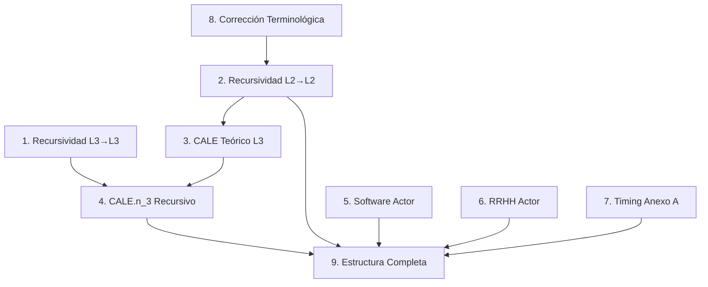

# PROMPT MAESTRO - MODELO BIM 5D SNCALE v2.0
## Guía Estructurada de Implementación

**Fecha**: 2025-11-03  
**Versión**: 2.0  
**Propósito**: Consolidar todas las decisiones arquitectónicas del modelo BIM 5D en prompts independientes y accionables

---

## 📋 ÍNDICE DE CAMBIOS ARQUITECTÓNICOS

### FASE A: FUNDAMENTOS DE RECURSIVIDAD
1. [CAMBIO 1: Recursividad L3→L3 (CALE Variantes)](#cambio-1-recursividad-l3)
2. [CAMBIO 2: Recursividad L2→L2 (Pistas Extendidas)](#cambio-2-recursividad-l2)

### FASE B: MODELO CALE TEÓRICO
3. [CAMBIO 3: CALE Teórico como L3 Independiente](#cambio-3-cale-teórico-l3)
4. [CAMBIO 4: CALE.n_3 con Recursividad L3→L3](#cambio-4-cale-n3-recursivo)

### FASE C: ACTORES ESPACIALES
5. [CAMBIO 5: Software como Actor Espacial (L0.SISTEMA)](#cambio-5-software-actor-espacial)
6. [CAMBIO 6: Talento Humano como Actor Espacial](#cambio-6-talento-actor-espacial)

### FASE D: TIMING 4D
7. [CAMBIO 7: Integración Timing desde Anexo A](#cambio-7-timing-anexo-a)

### FASE E: CORRECCIONES Y CONSOLIDACIÓN
8. [CAMBIO 8: Corrección Terminológica (Entrenamiento vs Entregamiento)](#cambio-8-corrección-terminológica)
9. [CAMBIO 9: Nueva Estructura L2/L3 Completa](#cambio-9-estructura-l2-l3)

---

## CAMBIO 1: RECURSIVIDAD L3 (CALE VARIANTES)

### 🎯 Objetivo
Modelar **CALE.n_1+** y **CALE.n_2****  como BIM independientes que heredan de sus configuraciones base mediante recursividad L3→L3.

### 📊 Problema Actual
```json
// ACTUAL: No existe recursividad en L3
{
  "BIM_L3_001": {
    "nombre": "CALE.n_1 Metropolitano",
    "variantes": "base + variante+"
    // ❌ No hay referencia explícita a componentes base
  }
}
```

### ✅ Solución Propuesta

#### Estructura con Recursividad L3→L3

```json
{
  "metadata": {
    "nivel": "L3",
    "recursividad": "L3→L3 habilitada",
    "patron": "HERENCIA_CONFIGURACION"
  },
  
  "componentes": {
    
    // BASE: CALE.n_1 (20 nodos base)
    "BIM_L3_001_BASE": {
      "bim_id": "BIM_L3_001_BASE",
      "codigo": "L3.CALE.n_1.base",
      "nombre": "CALE.n_1 Metropolitano - Configuración Base",
      "tipo": "CONFIGURACION_BASE",
      "nodos_aplicables": 20,
      "componentes_l2": [
        {
          "bim_id": "BIM_L2_003",
          "codigo": "L2.pista_clase_III",
          "cantidad": 1
        },
        {
          "bim_id": "BIM_L2_011",
          "codigo": "L2.cale_teorico_24q",
          "cantidad": 1
        }
        // ... otros L2
      ],
      "valor_total": 5500000000
    },
    
    // VARIANTE+: CALE.n_1+ (3 nodos adicionales)
    "BIM_L3_001_PLUS": {
      "bim_id": "BIM_L3_001_PLUS",
      "codigo": "L3.CALE.n_1.plus",
      "nombre": "CALE.n_1+ Metropolitano - Variante Extendida",
      "tipo": "CONFIGURACION_EXTENDIDA",
      "nodos_aplicables": 3,
      
      "recursividad_l3": {
        "referencia_base": "BIM_L3_001_BASE",
        "hereda_componentes": true,
        "componentes_adicionales": [
          {
            "bim_id": "BIM_L2_002",
            "codigo": "L2.pista_clase_II",
            "cantidad": 1,
            "justificacion": "Capacidad adicional para demanda alta"
          },
          {
            "bim_id": "BIM_L2_006",
            "codigo": "L2.datacenter_ampliado",
            "cantidad": 1,
            "justificacion": "Mayor capacidad procesamiento"
          }
        ]
      },
      
      "valor_incremental": 1200000000,
      "valor_total": 6700000000
    },
    
    // BASE: CALE.n_2 (20 nodos base)
    "BIM_L3_002_BASE": {
      "bim_id": "BIM_L3_002_BASE",
      "codigo": "L3.CALE.n_2.base",
      "nombre": "CALE.n_2 Intermedio - Configuración Base",
      "tipo": "CONFIGURACION_BASE",
      "nodos_aplicables": 20,
      "componentes_l2": [
        {
          "bim_id": "BIM_L2_002",
          "codigo": "L2.pista_clase_II",
          "cantidad": 1
        },
        {
          "bim_id": "BIM_L2_012",
          "codigo": "L2.cale_teorico_16q",
          "cantidad": 1
        }
        // ... otros L2
      ],
      "valor_total": 3200000000
    },
    
    // VARIANTE**: CALE.n_2** (16 nodos adicionales)
    "BIM_L3_002_STAR": {
      "bim_id": "BIM_L3_002_STAR",
      "codigo": "L3.CALE.n_2.star",
      "nombre": "CALE.n_2** Intermedio - Variante Extendida",
      "tipo": "CONFIGURACION_EXTENDIDA",
      "nodos_aplicables": 16,
      
      "recursividad_l3": {
        "referencia_base": "BIM_L3_002_BASE",
        "hereda_componentes": true,
        "componentes_adicionales": [
          {
            "bim_id": "BIM_L2_001",
            "codigo": "L2.pista_clase_I",
            "cantidad": 1,
            "justificacion": "Capacidad para categorías A1/A2 adicionales"
          }
        ]
      },
      
      "valor_incremental": 800000000,
      "valor_total": 4000000000
    }
  }
}
```

### 📝 Prompt de Implementación

```
TAREA: Implementar recursividad L3→L3 para variantes CALE

ARCHIVOS A CREAR/MODIFICAR:
1. TABLAS_L3_OFICIALES_V2.json
   - Separar cada CALE en _BASE y _VARIANTE
   - Agregar campo "recursividad_l3"
   - Calcular valores incrementales

2. funciones_recursividad_l3.py
   - Función resolver_l3_recursivo()
   - Validar herencia de componentes
   - Calcular totales agregados

3. generar_fichas_l3_recursivas.py
   - Regenerar fichas L3 con sección de recursividad
   - Mostrar componentes base + adicionales
   - Visualizar con <details> expandibles

VALIDACIONES:
- BIM_L3_001_PLUS debe heredar TODOS los L2 de BIM_L3_001_BASE
- Valor total = valor_base + valor_incremental
- No debe haber ciclos (L3_A → L3_B → L3_A)

OUTPUT ESPERADO:
- 6 configuraciones L3 (3 base + 3 variantes)
- 6 fichas HTML regeneradas
- Documento de validación recursividad
```

---

## CAMBIO 2: RECURSIVIDAD L2→L2 (PISTAS EXTENDIDAS)

### 🎯 Objetivo
Modelar las **Pistas como configuraciones extendidas** donde cada clase superior hereda de la clase inferior mediante recursividad L2→L2.

### 📊 Problema Actual
```json
// ACTUAL: Cada pista se modela independiente con duplicación
{
  "BIM_L2_001": {
    "codigo": "L2.pista_clase_I",
    "componentes": ["L1.area_maniobras", "L1.area_estacionamiento", ...]
    // ❌ Duplicación: clase_II y clase_III repiten componentes
  },
  "BIM_L2_002": {
    "codigo": "L2.pista_clase_II",
    "componentes": ["L1.area_maniobras", "L1.area_estacionamiento", ...]
    // ❌ Los mismos componentes + algunos adicionales
  }
}
```

### ✅ Solución Propuesta

#### Estructura con Recursividad L2→L2

```json
{
  "metadata": {
    "nivel": "L2",
    "recursividad": "L2→L2 habilitada",
    "patron": "HERENCIA_CONFIGURACION"
  },
  
  "componentes": {
    
    // BASE: Pista Clase I (más básica)
    "BIM_L2_001_BASE": {
      "bim_id": "BIM_L2_001",
      "codigo": "L2.pista_clase_I",
      "nombre": "Pista Clase I - Configuración Base",
      "tipo": "CONFIGURACION_BASE",
      "categorias_soportadas": ["A1", "A2", "B1"],
      
      "componentes_l1": [
        {
          "bim_id": "BIM_L1_001",
          "codigo": "L1.area_maniobras",
          "cantidad": 1,
          "valor": 450000000
        },
        {
          "bim_id": "BIM_L1_002",
          "codigo": "L1.area_estacionamiento",
          "cantidad": 1,
          "valor": 180000000
        },
        {
          "bim_id": "BIM_L1_003",
          "codigo": "L1.circuito_urbano",
          "cantidad": 1,
          "valor": 91440000
        }
      ],
      
      "valor_total": 721440000
    },
    
    // EXTENDIDA: Pista Clase II (hereda de Clase I + adicionales)
    "BIM_L2_002_EXTENDED": {
      "bim_id": "BIM_L2_002",
      "codigo": "L2.pista_clase_II",
      "nombre": "Pista Clase II - Configuración Extendida",
      "tipo": "CONFIGURACION_EXTENDIDA",
      "categorias_soportadas": ["A1", "A2", "B1", "B2", "C1"],
      
      "recursividad_l2": {
        "referencia_base": "BIM_L2_001",
        "hereda_componentes": true,
        "descripcion": "Pista Clase II = Clase I + componentes adicionales",
        "componentes_adicionales": [
          {
            "bim_id": "BIM_L1_004",
            "codigo": "L1.area_carga_descarga",
            "cantidad": 1,
            "valor": 120000000,
            "justificacion": "Requerido para categoría B2 (vehículos de carga)"
          },
          {
            "bim_id": "BIM_L1_005",
            "codigo": "L1.rampa_pendiente",
            "cantidad": 1,
            "valor": 45000000,
            "justificacion": "Evaluación en pendientes para C1"
          }
        ]
      },
      
      "valor_incremental": 165000000,
      "valor_total": 886440000,
      "formula": "Clase I (721.4M) + Componentes adicionales (165M)"
    },
    
    // EXTENDIDA: Pista Clase III (hereda de Clase II + adicionales)
    "BIM_L2_003_EXTENDED": {
      "bim_id": "BIM_L2_003",
      "codigo": "L2.pista_clase_III",
      "nombre": "Pista Clase III - Configuración Máxima",
      "tipo": "CONFIGURACION_EXTENDIDA",
      "categorias_soportadas": ["TODAS (A1-C3)"],
      
      "recursividad_l2": {
        "referencia_base": "BIM_L2_002",
        "hereda_componentes": true,
        "descripcion": "Pista Clase III = Clase II + componentes especializados",
        "componentes_adicionales": [
          {
            "bim_id": "BIM_L1_006",
            "codigo": "L1.area_articulados",
            "cantidad": 1,
            "valor": 200000000,
            "justificacion": "Requerido para categorías B3/C3 (tractocamiones)"
          },
          {
            "bim_id": "BIM_L1_007",
            "codigo": "L1.circuito_carretera",
            "cantidad": 1,
            "valor": 180000000,
            "justificacion": "Simulación conducción en carretera para C2/C3"
          }
        ]
      },
      
      "valor_incremental": 380000000,
      "valor_total": 1266440000,
      "formula": "Clase II (886.4M) + Componentes especializados (380M)"
    }
  }
}
```

### Visualización de Herencia

```
L2.pista_clase_I (BASE)
    ├─ L1.area_maniobras (450M)
    ├─ L1.area_estacionamiento (180M)
    └─ L1.circuito_urbano (91.4M)
    TOTAL: 721.4M

L2.pista_clase_II (EXTENDIDA)
    ├─ HEREDA → L2.pista_clase_I (721.4M)
    └─ AGREGA:
        ├─ L1.area_carga_descarga (120M)
        └─ L1.rampa_pendiente (45M)
    TOTAL: 886.4M

L2.pista_clase_III (EXTENDIDA)
    ├─ HEREDA → L2.pista_clase_II (886.4M)
    └─ AGREGA:
        ├─ L1.area_articulados (200M)
        └─ L1.circuito_carretera (180M)
    TOTAL: 1,266.4M
```

### 📝 Prompt de Implementación

```
TAREA: Implementar recursividad L2→L2 para pistas extendidas

ARCHIVOS A CREAR/MODIFICAR:
1. TABLAS_L2_PISTAS_V2.json
   - Separar L2.pista_clase_I como BASE
   - Modelar L2.pista_clase_II con recursividad → clase_I
   - Modelar L2.pista_clase_III con recursividad → clase_II
   - Agregar campo "recursividad_l2"

2. funciones_recursividad_l2.py
   - Función resolver_l2_recursivo(bim_id)
   - Validar herencia de componentes L1
   - Calcular totales agregados
   - Evitar ciclos (L2_A → L2_B → L2_A)

3. generar_fichas_l2_pistas.py
   - Regenerar fichas L2 de pistas
   - Sección visual de herencia
   - Mostrar componentes heredados vs adicionales
   - Tabla comparativa de capacidades

VALIDACIONES:
- BIM_L2_002 debe heredar TODOS los L1 de BIM_L2_001
- BIM_L2_003 debe heredar TODOS los L1 de BIM_L2_002 (transitivo)
- Valor total = suma de base + incrementales
- No debe haber ciclos en la cadena de herencia

FÓRMULAS DE VALIDACIÓN:
- clase_II = clase_I + adicionales
- clase_III = clase_II + adicionales = clase_I + adicionales_II + adicionales_III

OUTPUT ESPERADO:
- 3 configuraciones L2 de pistas con recursividad
- 3 fichas HTML regeneradas con visualización de herencia
- Documento de validación de valores
- Diagrama de dependencias L2→L2
```

---

## CAMBIO 3: CALE TEÓRICO COMO L3 INDEPENDIENTE

### 🎯 Objetivo
Modelar **CALE Teórico** (primera fase - solo evaluación teórica) como nivel L3 independiente, con variantes por capacidad de cubículos.

### 📊 Problema Actual
```
ACTUAL:
- L2.cale_teorico_24q (existe en MUNAY)
- L2.cale_teorico_16q (existe en MUNAY)
- ❌ No están modelados como CALE completos L3
- ❌ No se pueden desplegar independientemente
```

### ✅ Solución Propuesta

#### CALE Teórico como L3

```json
{
  "BIM_L3_010": {
    "bim_id": "BIM_L3_010",
    "codigo": "L3.CALE_TEORICO.24q",
    "nombre": "CALE Teórico - 24 Cubículos (Primera Fase)",
    "descripcion": "Centro completo para evaluación TEÓRICA únicamente - Despliegue Fase 1",
    "tipo": "CALE_TEORICO_FASE_1",
    "capacidad_cubiculos": 24,
    
    "componentes_l2": [
      {
        "bim_id": "BIM_L2_004",
        "codigo": "L2.sala_24_cubiculos",
        "nombre": "Sala Teórica 24 Cubículos",
        "variante": "24q",
        "cantidad": 1,
        "valor": 180000000,
        "categoria": "INFRAESTRUCTURA_TEORICA"
      },
      {
        "bim_id": "BIM_L2_005",
        "codigo": "L2.sala_formacion",
        "nombre": "Sala Formación 30 PAX",
        "variante": "30_pax",
        "cantidad": 1,
        "valor": 45000000,
        "categoria": "INFRAESTRUCTURA_TEORICA"
      },
      {
        "bim_id": "BIM_L2_008",
        "codigo": "L2.zona_administrativa",
        "nombre": "Zona Administrativa 3 Oficinas",
        "variante": "3_oficinas",
        "cantidad": 1,
        "valor": 120000000,
        "categoria": "ADMINISTRATIVA"
      },
      {
        "bim_id": "BIM_L2_007",
        "codigo": "L2.parqueadero",
        "nombre": "Parqueadero 40 Vehículos",
        "variante": "40_veh",
        "cantidad": 1,
        "valor": 80000000,
        "categoria": "ADMINISTRATIVA"
      },
      {
        "bim_id": "BIM_L2_010",
        "codigo": "L2.edificacion_adecuada",
        "nombre": "Edificación Adecuada",
        "cantidad": 1,
        "valor": 200000000,
        "categoria": "CIVIL"
      }
    ],
    
    "valor_total": 625000000,
    
    "caracteristicas": {
      "evaluacion_practica": false,
      "evaluacion_teorica": true,
      "categorias_soportadas": ["TODAS (solo teórico)"],
      "fase_despliegue": 1,
      "upgrade_path": "BIM_L3_003 (agregar L2.pista_clase_I)"
    }
  },
  
  "BIM_L3_011": {
    "bim_id": "BIM_L3_011",
    "codigo": "L3.CALE_TEORICO.16q",
    "nombre": "CALE Teórico - 16 Cubículos (Primera Fase)",
    "descripcion": "Centro compacto para evaluación TEÓRICA - Despliegue Fase 1",
    "tipo": "CALE_TEORICO_FASE_1",
    "capacidad_cubiculos": 16,
    
    "componentes_l2": [
      {
        "bim_id": "BIM_L2_004",
        "codigo": "L2.sala_24_cubiculos",
        "nombre": "Sala Teórica 16 Cubículos",
        "variante": "16q",
        "cantidad": 1,
        "valor": 120000000
      }
      // ... componentes similares ajustados
    ],
    
    "valor_total": 520000000,
    
    "caracteristicas": {
      "evaluacion_practica": false,
      "evaluacion_teorica": true,
      "categorias_soportadas": ["TODAS (solo teórico)"],
      "fase_despliegue": 1,
      "upgrade_path": "BIM_L3_003 o BIM_L3_002"
    }
  },
  
  "BIM_L3_012": {
    "bim_id": "BIM_L3_012",
    "codigo": "L3.CALE_TEORICO.4q",
    "nombre": "CALE Teórico - 4 Cubículos (Primera Fase)",
    "descripcion": "Centro básico para evaluación TEÓRICA - Municipios pequeños",
    "tipo": "CALE_TEORICO_FASE_1",
    "capacidad_cubiculos": 4,
    
    "componentes_l2": [
      {
        "bim_id": "BIM_L2_004",
        "codigo": "L2.sala_24_cubiculos",
        "nombre": "Sala Teórica 4 Cubículos",
        "variante": "4q",
        "cantidad": 1,
        "valor": 40000000
      }
      // ... componentes ajustados
    ],
    
    "valor_total": 320000000
  }
}
```

#### Composición de CALE.n_3 CON Teórico

```json
{
  "BIM_L3_003": {
    "bim_id": "BIM_L3_003",
    "codigo": "L3.CALE.n_3",
    "nombre": "CALE.n_3 Local - Teórico + Práctico",
    "tipo": "CALE_COMPLETO",
    
    "recursividad_l3": {
      "descripcion": "CALE.n_3 compuesto por CALE Teórico + Infraestructura Práctica",
      "componentes_l3": [
        {
          "referencia": "BIM_L3_011",
          "codigo": "L3.CALE_TEORICO.16q",
          "nombre": "CALE Teórico 16q completo",
          "valor": 520000000,
          "resuelve_a": [
            "L2.sala_24_cubiculos (16q)",
            "L2.sala_formacion",
            "L2.zona_administrativa",
            "L2.parqueadero",
            "L2.edificacion_adecuada"
          ]
        }
      ],
      "componentes_l2_adicionales": [
        {
          "bim_id": "BIM_L2_001",
          "codigo": "L2.pista_clase_I",
          "nombre": "Pista Clase I",
          "valor": 721440000,
          "categoria": "INFRAESTRUCTURA_PRACTICA"
        }
      ]
    },
    
    "valor_total": 1241440000,
    
    "formula_construccion": "L3.CALE_TEORICO.16q + L2.pista_clase_I"
  }
}
```

### 📝 Prompt de Implementación

```
TAREA: Crear CALE Teórico como L3 independiente (Fase 1 del Plan de Implementación)

ARCHIVOS A CREAR/MODIFICAR:
1. TABLAS_L3_CALE_TEORICO.json (NUEVO)
   - BIM_L3_010: CALE Teórico 24q
   - BIM_L3_011: CALE Teórico 16q
   - BIM_L3_012: CALE Teórico 4q

2. TABLAS_L3_OFICIALES_V2.json
   - Actualizar BIM_L3_003 (CALE.n_3) con recursividad L3→L3
   - Referenciar L3.CALE_TEORICO.16q como componente

3. generar_fichas_l3_teorico.py (NUEVO)
   - Generar 3 fichas HTML para CALE Teórico
   - Incluir badge "FASE 1 - Solo Teórico"
   - Mostrar upgrade path a CALE completo

VALIDACIONES:
- Verificar que L3.CALE_TEORICO no incluya pistas
- Validar que upgrade path sea correcto
- Confirmar valores con MUNAY_5.2 Tablas #16, #17

OUTPUT ESPERADO:
- 3 configuraciones L3 CALE Teórico
- 3 fichas HTML nuevas
- Documento "Estrategia Despliegue Fase 1"
```

---

## CAMBIO 4: CALE.n_3 CON RECURSIVIDAD L3→L3

### 🎯 Objetivo
Modelar **CALE.n_3** como composición de **L3.CALE_TEORICO.16q + L2.pista_clase_I**, usando recursividad L3→L3.

### 📊 Concepto Clave

```
CALE.n_3 NO es suma de L1
CALE.n_3 = CALE_TEORICO.16q (L3) + Pista Clase I (L2)
```

### ✅ Implementación con Recursividad L3→L3

```json
{
  "BIM_L3_003": {
    "bim_id": "BIM_L3_003",
    "codigo": "L3.CALE.n_3",
    "nombre": "CALE.n_3 Local - Teórico + Práctico Básico",
    "tipo": "CALE_COMPLETO_COMPUESTO",
    "descripcion": "Centro de evaluación local con capacidad teórica (16q) y práctica (Clase I)",
    
    "nodos_aplicables": 56,
    "categorias_soportadas": ["A1", "A2", "B1"],
    
    "recursividad_l3": {
      "patron": "L3 → L3 + L2",
      "descripcion": "CALE.n_3 compuesto por CALE Teórico completo + infraestructura práctica",
      
      "componentes_l3": [
        {
          "bim_id": "BIM_L3_011",
          "codigo": "L3.CALE_TEORICO.16q",
          "nombre": "CALE Teórico 16 Cubículos",
          "tipo": "COMPONENTE_L3",
          "valor": 520000000,
          "descripcion": "Centro teórico completo operativo",
          
          "resuelve_a_l2": [
            "L2.sala_cubiculos (16q)",
            "L2.sala_formacion (20pax)",
            "L2.zona_administrativa (3of)",
            "L2.parqueadero (40veh)",
            "L2.edificacion_adecuada",
            "L2.servicios_publicos",
            "L2.datacenter (12m²)"
          ],
          
          "resuelve_a_actores": [
            "L0.SISTEMA.ALEYA (módulo teórico)",
            "L0.SISTEMA.MUNAY (módulo check-in)",
            "RRHH.coordinador_teorico",
            "RRHH.auxiliar_administrativo"
          ]
        }
      ],
      
      "componentes_l2_adicionales": [
        {
          "bim_id": "BIM_L2_001",
          "codigo": "L2.pista_clase_I",
          "nombre": "Pista Clase I",
          "valor": 721440000,
          "categoria": "INFRAESTRUCTURA_PRACTICA",
          "descripcion": "Infraestructura para evaluación práctica A1/A2/B1",
          
          "resuelve_a_l1": [
            "L1.area_maniobras",
            "L1.area_estacionamiento",
            "L1.circuito_urbano"
          ],
          
          "resuelve_a_actores": [
            "L0.SISTEMA.ALEYA (módulo práctico GPS)",
            "RRHH.evaluador_clase_I",
            "RRHH.auxiliar_pista"
          ]
        }
      ]
    },
    
    "valor_total": 1241440000,
    "formula_construccion": "L3.CALE_TEORICO.16q (520M) + L2.pista_clase_I (721.4M)",
    
    "capacidad_operativa": {
      "evaluaciones_teoricas_mes": 500,
      "evaluaciones_practicas_mes": 300,
      "personal_requerido": {
        "coordinador": 1,
        "evaluadores_practicos": 2,
        "auxiliares": 2,
        "administrativos": 2
      }
    },
    
    "upgrade_path": {
      "a_cale_n2": {
        "descripcion": "Reemplazar L2.pista_clase_I por L2.pista_clase_II",
        "incremento": 165000000,
        "nuevas_categorias": ["B2", "C1"]
      },
      "a_cale_n1": {
        "descripcion": "Reemplazar L2.pista_clase_I por L2.pista_clase_III + Ampliar CALE Teórico a 24q",
        "incremento": 650000000,
        "nuevas_categorias": ["Todas A1-C3"]
      }
    }
  }
}
```

### Diagrama de Composición

```
L3.CALE.n_3 (1,241.4M)
│
├─ [L3] CALE_TEORICO.16q (520M)
│   ├─ [L2] sala_cubiculos.16q (120M)
│   ├─ [L2] sala_formacion.20pax (45M)
│   ├─ [L2] zona_administrativa.3of (120M)
│   ├─ [L2] parqueadero.40veh (80M)
│   ├─ [L2] edificacion_adecuada (200M)
│   ├─ [L2] servicios_publicos (35M)
│   └─ [ACTORES]
│       ├─ SISTEMA.ALEYA (módulo teórico)
│       ├─ SISTEMA.MUNAY (check-in)
│       └─ RRHH (coordinador + admin)
│
└─ [L2] pista_clase_I (721.4M)
    ├─ [L1] area_maniobras (450M)
    ├─ [L1] area_estacionamiento (180M)
    ├─ [L1] circuito_urbano (91.4M)
    └─ [ACTORES]
        ├─ SISTEMA.ALEYA (GPS + sensores)
        └─ RRHH (2 evaluadores + auxiliar)
```

### Función de Resolución

```python
def resolver_l3_completo(bim_id):
    """
    Resuelve un L3 con recursividad L3→L3+L2
    """
    l3 = cargar_bim_l3(bim_id)
    
    componentes_resueltos = {
        "l3_incluidos": [],
        "l2_directos": [],
        "l1_transitivos": [],
        "actores_espaciales": []
    }
    
    # 1. Resolver componentes L3
    if "recursividad_l3" in l3 and "componentes_l3" in l3["recursividad_l3"]:
        for comp_l3 in l3["recursividad_l3"]["componentes_l3"]:
            # Recursión: resolver el L3 componente
            sub_resolucion = resolver_l3_completo(comp_l3["bim_id"])
            componentes_resueltos["l3_incluidos"].append({
                "l3": comp_l3,
                "resuelve_a": sub_resolucion
            })
    
    # 2. Resolver componentes L2 adicionales
    if "recursividad_l3" in l3 and "componentes_l2_adicionales" in l3["recursividad_l3"]:
        for comp_l2 in l3["recursividad_l3"]["componentes_l2_adicionales"]:
            # Resolver L2 (puede tener recursividad L2→L2)
            sub_resolucion_l2 = resolver_l2_recursivo(comp_l2["bim_id"])
            componentes_resueltos["l2_directos"].append({
                "l2": comp_l2,
                "resuelve_a": sub_resolucion_l2
            })
    
    # 3. Agregar actores espaciales
    componentes_resueltos["actores_espaciales"] = extraer_actores(l3)
    
    return componentes_resueltos
```

### 📝 Prompt de Implementación

```
TAREA: Implementar CALE.n_3 como composición L3→L3+L2

ARCHIVOS A CREAR/MODIFICAR:
1. TABLAS_L3_OFICIALES_V2.json
   - Actualizar BIM_L3_003 con recursividad L3→L3
   - Referenciar BIM_L3_011 (CALE Teórico 16q)
   - Agregar BIM_L2_001 (Pista Clase I) como componente

2. funciones_recursividad_l3_avanzada.py (NUEVO)
   - resolver_l3_completo(bim_id)
   - Soportar recursividad L3 → L3 + L2
   - Validar no-ciclos en L3
   - Calcular totales agregados

3. generar_ficha_cale_n3.py (ACTUALIZAR)
   - Mostrar diagrama de composición
   - Sección "Componentes L3 incluidos"
   - Sección "Componentes L2 adicionales"
   - Upgrade paths a CALE.n_2 y CALE.n_1

4. validar_cale_n3.py (NUEVO)
   - Verificar que L3.CALE_TEORICO.16q existe
   - Verificar que L2.pista_clase_I existe
   - Validar suma de valores
   - Confirmar que no hay duplicación de L1

VALIDACIONES CRÍTICAS:
- L3_003 NO debe tener componentes L1 directos
- L3_003 debe componerse de L3_011 + L2_001
- Valor total = 520M + 721.4M = 1,241.4M
- No debe haber duplicación de espacios (ej: recepción)

REGLA DE ORO:
"Un L3 puede contener otros L3 + L2, pero NUNCA L1 directamente"

OUTPUT ESPERADO:
- BIM_L3_003 reestructurado con recursividad
- Ficha HTML con visualización de composición
- Documento de validación de no-duplicación
- Diagrama de dependencias L3→L3→L2→L1
```

---

## CAMBIO 5: SOFTWARE COMO ACTOR ESPACIAL (L0.SISTEMA)

### 📊 Error Identificado

```json
// ❌ INCORRECTO
{
  "timing": {
    "entregamiento_max": 10,  // ERROR: término inadecuado
    "descripcion": "Capacitación y transferencia"
  }
}
```

### ✅ Corrección

```json
// ✅ CORRECTO
{
  "timing": {
    "entrenamiento": {
      "dias": 10,
      "descripcion": "Capacitación y formación de personal",
      "hitos": [
        "Capacitación técnica (5 días)",
        "Entrenamiento en campo (3 días)",
        "Certificación (2 días)"
      ]
    },
    "entrega_formal": {
      "dias": 1,
      "descripcion": "Acta de entrega y transferencia oficial",
      "hitos": [
        "Inspección final",
        "Firma de actas",
        "Transferencia de responsabilidad"
      ]
    }
  }
}
```

### 📝 Prompt de Implementación

```
TAREA: Corrección terminológica en campos de timing

ARCHIVOS A MODIFICAR:
1. ANALISIS_CRITICO_MODELO_BIM_5D.md
   - Buscar todas las ocurrencias de "entregamiento"
   - Reemplazar por "entrenamiento" o "entrega_formal" según contexto

2. TABLAS_L0_OFICIALES.json (cuando se agregue timing)
   - Usar "entrenamiento" en lugar de "entregamiento"
   - Separar claramente: entrenamiento (capacitación) vs entrega_formal (acta)

3. Todas las fichas HTML que se generen
   - Actualizar terminología en secciones de timing

REGLA:
- "entrenamiento" = Capacitación de personal (días/semanas)
- "entrega_formal" = Acto administrativo de transferencia (horas/1 día)

OUTPUT ESPERADO:
- Terminología consistente en todos los documentos
- No más referencias a "entregamiento"
```

---

## CAMBIO 4: SOFTWARE COMO ACTOR ESPACIAL (L0.SISTEMA)

### 🎯 Objetivo
Modelar software (Aleya, Munay) como **actores invisibles** que se cuantifican **DONDE APORTAN FUNCIONALIDAD**, no donde están físicamente instalados.

### 📊 Problema Conceptual Actual

```json
// ❌ ENFOQUE INCORRECTO (Ubicación física)
{
  "BIM_L0_083": {
    "codigo": "L0.SW_ALEYA",
    "ubicacion_fisica": "L2.datacenter_12m2",  // ❌ Aquí NO se usa
    "valor": 50000000
  }
}
```

### ✅ Solución: Actor Espacial

```json
{
  "BIM_L0_083": {
    "bim_id": "BIM_L0_083",
    "codigo": "L0.SISTEMA.ALEYA",
    "nombre": "Plataforma Aleya - Licencia Sistema",
    "categoria": "SISTEMA_SOFTWARE",
    "tipo_componente": "ACTOR_ESPACIAL",
    
    "descripcion": "Sistema de evaluación teórica y práctica - Actor invisible que aporta funcionalidad en múltiples espacios",
    
    "valor_licencia_base": 50000000,
    "modelo_costo": "PaaS_mensual",
    
    "activaciones_espaciales": [
      {
        "espacio": "L1.recepcion",
        "funcionalidad": "Validación biométrica de identidad",
        "costo_unitario": 500000,
        "unidad": "atenciones/mes",
        "capacidad": 1000,
        "costo_mensual_espacio": 500000,
        "descripcion": "Módulo de registro y verificación de aspirantes"
      },
      {
        "espacio": "L2.sala_24_cubiculos",
        "funcionalidad": "Evaluación teórica digital",
        "costo_unitario": 100000,
        "unidad": "evaluaciones/mes",
        "capacidad": 500,
        "costo_mensual_espacio": 2000000,
        "descripcion": "Módulo de examen teórico con 24 puestos simultáneos"
      },
      {
        "espacio": "L2.pista_clase_I",
        "funcionalidad": "Evaluación práctica con GPS/sensores",
        "costo_unitario": 200000,
        "unidad": "evaluaciones/mes",
        "capacidad": 300,
        "costo_mensual_espacio": 1500000,
        "descripcion": "Módulo de evaluación práctica con tracking GPS y sensores"
      },
      {
        "espacio": "L2.zona_administrativa",
        "funcionalidad": "Dashboard de gestión y reportes",
        "costo_unitario": 300000,
        "unidad": "usuarios/mes",
        "capacidad": 10,
        "costo_mensual_espacio": 300000,
        "descripcion": "Módulo administrativo para coordinadores"
      }
    ],
    
    "costo_total_mensual": 4300000,
    "costo_anual": 51600000,
    
    "infraestructura_requerida": {
      "servidor_aplicaciones": {
        "ubicacion": "L2.datacenter_12m2",
        "specs": "32GB RAM, 8 cores, 500GB storage",
        "costo_incluido_en": "L0.servidor_aplicaciones"
      },
      "red_datos": {
        "ubicacion": "Todos los espacios",
        "ancho_banda_min": "100 Mbps",
        "costo_incluido_en": "L0.red_datos"
      }
    },
    
    "timing": {
      "adquisicion": {
        "dias": 90,
        "descripcion": "Licitación y contratación software especializado",
        "fuente": "Anexo A - Actividad A.3.2"
      },
      "instalacion": {
        "dias": 10,
        "descripcion": "Despliegue en servidores",
        "fuente": "Anexo A - Actividad A.4.1"
      },
      "configuracion": {
        "dias": 20,
        "descripcion": "Parametrización SNCALE",
        "fuente": "Anexo A - Actividad A.4.2"
      },
      "entrenamiento": {
        "dias": 15,
        "descripcion": "Capacitación evaluadores y administrativos",
        "fuente": "Anexo A - Actividad A.5.1"
      },
      "total_dias": 135
    }
  },
  
  "BIM_L0_084": {
    "bim_id": "BIM_L0_084",
    "codigo": "L0.SISTEMA.MUNAY",
    "nombre": "Plataforma Munay - Sistema ERP",
    "categoria": "SISTEMA_SOFTWARE",
    "tipo_componente": "ACTOR_ESPACIAL",
    
    "activaciones_espaciales": [
      {
        "espacio": "L1.recepcion",
        "funcionalidad": "Validación biométrica + Agenda de citas",
        "costo_unitario": 300000,
        "unidad": "atenciones/mes",
        "capacidad": 1000,
        "costo_mensual_espacio": 600000,
        "descripcion": "CHECK-IN: Validación identidad + Asignación de horarios"
      },
      {
        "espacio": "L2.zona_administrativa",
        "funcionalidad": "ERP Completo (Facturación, RRHH, Inventarios)",
        "costo_unitario": 500000,
        "unidad": "usuarios/mes",
        "capacidad": 15,
        "costo_mensual_espacio": 2500000,
        "descripcion": "Gestión administrativa completa"
      },
      {
        "espacio": "L3.HUB_nacional",
        "funcionalidad": "Analytics + Reportes consolidados red nacional",
        "costo_unitario": 1000000,
        "unidad": "nodos/mes",
        "capacidad": 197,
        "costo_mensual_espacio": 3000000,
        "descripcion": "Dashboard ejecutivo y analítica predictiva"
      }
    ],
    
    "costo_total_mensual": 6100000,
    "costo_anual": 73200000
  }
}
```

### Cuantificación en L1 (Recepción)

```json
{
  "BIM_L1_020": {
    "bim_id": "BIM_L1_020",
    "codigo": "L1.recepcion",
    "nombre": "Área de Recepción y Registro",
    
    "componentes_l0": [
      {
        "bim_id": "BIM_L0_045",
        "codigo": "L0.mostrador_recepcion",
        "cantidad": 1,
        "valor": 1500000
      },
      {
        "bim_id": "BIM_L0_046",
        "codigo": "L0.silla_recepcionista",
        "cantidad": 2,
        "valor": 280000
      },
      // AQUÍ SE CUANTIFICA EL SOFTWARE
      {
        "bim_id": "BIM_L0_083",
        "codigo": "L0.SISTEMA.ALEYA",
        "tipo": "ACTOR_ESPACIAL",
        "funcionalidad_activa": "Validación biométrica de identidad",
        "costo_mensual": 500000,
        "costo_anual": 6000000,
        "descripcion": "Sistema Aleya activo en recepción para registro de aspirantes"
      },
      {
        "bim_id": "BIM_L0_084",
        "codigo": "L0.SISTEMA.MUNAY",
        "tipo": "ACTOR_ESPACIAL",
        "funcionalidad_activa": "Validación biométrica + Agenda de citas",
        "costo_mensual": 600000,
        "costo_anual": 7200000,
        "descripcion": "Sistema Munay activo en recepción para check-in y agendamiento"
      }
    ],
    
    "valor_capex": 3500000,
    "valor_opex_anual_software": 13200000,
    "valor_total_anual": 16700000
  }
}
```

### 📝 Prompt de Implementación

```
TAREA: Modelar software como actores espaciales con activaciones por área funcional

ARCHIVOS A CREAR:
1. TABLAS_L0_SISTEMAS.json (NUEVO)
   - Categoría "SISTEMA_SOFTWARE"
   - Tipo "ACTOR_ESPACIAL"
   - Campo "activaciones_espaciales" (array)
   - Costo por espacio/funcionalidad

2. funciones_actores_espaciales.py (NUEVO)
   - calcular_costo_sistema_por_espacio()
   - resolver_activaciones()
   - agregar_opex_sistemas_a_l1()

3. TABLAS_L1_CON_ACTORES.json (ACTUALIZAR)
   - Agregar componentes L0.SISTEMA a cada L1 relevante
   - Calcular OPEX mensual/anual por espacio
   - Separar CAPEX (físico) vs OPEX (software/sistemas)

REGLA FUNDAMENTAL:
"Los sistemas se cuantifican DONDE SE USAN, NO donde se instalan"

EJEMPLO:
- Aleya físicamente en L2.datacenter
- Aleya se CUANTIFICA en:
  * L1.recepcion (validación biométrica)
  * L2.sala_teorica (evaluación digital)
  * L2.pista (sensores GPS)
  * L2.zona_admin (reportes)

OUTPUT ESPERADO:
- Nuevo modelo de costeo por funcionalidad
- OPEX software visible por área de negocio
- Trazabilidad: ¿Cuánto cuesta Aleya en recepción? → $500K/mes
```

---

## CAMBIO 5: TALENTO HUMANO COMO ACTOR ESPACIAL

### 🎯 Objetivo
Modelar personal como **actores que se activan en áreas específicas** para cumplir funciones, cuantificados como costo mensual OPEX.

### ✅ Estructura de Actor RRHH

```json
{
  "BIM_RRHH_001": {
    "bim_id": "BIM_RRHH_001",
    "codigo": "RRHH.evaluador_clase_III",
    "nombre": "Evaluador Práctico Clase III",
    "categoria": "TALENTO_HUMANO",
    "tipo_componente": "ACTOR_ESPACIAL_RRHH",
    
    "perfil": {
      "formacion": "Licencia de conducción C3 vigente",
      "experiencia": "2 años como conductor profesional",
      "certificaciones": ["Capacitación evaluador SNCALE (80h)", "Primeros auxilios"],
      "competencias": ["Evaluación objetiva", "Comunicación asertiva", "Manejo de estrés"]
    },
    
    "salario_mensual": 4500000,
    "prestaciones_factor": 1.52,
    "costo_mensual_total": 6840000,
    "costo_anual": 82080000,
    
    "activaciones_espaciales": [
      {
        "espacio": "L2.pista_clase_III",
        "funcion": "Evaluación práctica categorías B3/C3",
        "dedicacion": "6h/día",
        "capacidad": "8 evaluaciones/día",
        "costo_por_evaluacion": 28500,
        "descripcion": "Evaluador activo en pista para tractocamiones"
      },
      {
        "espacio": "L2.zona_administrativa",
        "funcion": "Reporte de evaluaciones y retroalimentación",
        "dedicacion": "2h/día",
        "descripcion": "Documentación y retroalimentación a aspirantes"
      }
    ],
    
    "timing_rrhh": {
      "convocatoria": {
        "dias": 15,
        "descripcion": "Publicación y recepción hojas de vida",
        "fuente": "Anexo A - Plan RRHH"
      },
      "seleccion": {
        "dias": 10,
        "descripcion": "Entrevistas, pruebas técnicas, verificación referencias",
        "fuente": "Anexo A - Plan RRHH"
      },
      "contratacion": {
        "dias": 5,
        "descripcion": "Firma de contrato, afiliaciones, documentación",
        "fuente": "Anexo A - Plan RRHH"
      },
      "entrenamiento": {
        "dias": 20,
        "descripcion": "Inducción + Capacitación técnica + Certificación",
        "fuente": "Anexo A - Actividad A.5.2"
      },
      "total_dias": 50
    }
  }
}
```

### Cuantificación en L2 (Pista)

```json
{
  "BIM_L2_003": {
    "bim_id": "BIM_L2_003",
    "codigo": "L2.pista_clase_III",
    "nombre": "Pista Clase III",
    
    "componentes_fisicos_l1": [
      // ... componentes físicos
    ],
    
    "actores_rrhh_requeridos": [
      {
        "bim_id": "BIM_RRHH_001",
        "codigo": "RRHH.evaluador_clase_III",
        "cantidad": 2,
        "turnos": "Lunes a Sábado 8h/día",
        "costo_mensual_unitario": 6840000,
        "costo_mensual_total": 13680000,
        "costo_anual": 164160000,
        "funcion_activa": "Evaluación práctica B3/C3"
      },
      {
        "bim_id": "BIM_RRHH_005",
        "codigo": "RRHH.auxiliar_pista",
        "cantidad": 1,
        "costo_mensual": 3500000,
        "costo_anual": 42000000,
        "funcion_activa": "Señalización y seguridad vial durante evaluaciones"
      }
    ],
    
    "valor_capex_infraestructura": 2093340000,
    "valor_opex_anual_rrhh": 206160000,
    "ratio_opex_rrhh_vs_capex": "9.8%"
  }
}
```

### 📝 Prompt de Implementación

```
TAREA: Modelar talento humano como actores espaciales con timing de incorporación

ARCHIVOS A CREAR:
1. TABLAS_RRHH_ACTORES.json (NUEVO)
   - Categoría "TALENTO_HUMANO"
   - Tipo "ACTOR_ESPACIAL_RRHH"
   - Perfiles de cargo completos
   - Salarios + prestaciones
   - Timing de incorporación (convocatoria → certificación)

2. funciones_rrhh_actores.py (NUEVO)
   - calcular_costo_rrhh_por_espacio()
   - resolver_activaciones_rrhh()
   - agregar_opex_rrhh_a_l2()

3. TABLAS_L2_CON_RRHH.json (ACTUALIZAR)
   - Agregar campo "actores_rrhh_requeridos"
   - Calcular OPEX RRHH anual
   - Ratio OPEX/CAPEX

4. TIMING_ANEXO_A_RRHH.json (EXTRAER DE ANEXO A)
   - Tiempos de convocatoria
   - Tiempos de selección
   - Tiempos de entrenamiento
   - Cronograma de incorporación

REGLA:
"El personal se cuantifica en el ÁREA DONDE TRABAJA, con timing desde convocatoria hasta certificación"

OUTPUT ESPERADO:
- Catálogo de 20-30 perfiles RRHH
- Costeo OPEX por área operativa
- Cronograma de incorporación de personal
- Modelo financiero CAPEX + OPEX completo
```

---

## CAMBIO 7: INTEGRACIÓN TIMING DESDE ANEXO A

### 🎯 Objetivo
Extraer tiempos del **Anexo A (Plan de Implementación)** para poblar automáticamente los campos `timing` de todos los componentes BIM.

### 📊 Fuente de Datos

```
ANEXO A - PLAN DE IMPLEMENTACIÓN
├─ Fase 1: Preinversión (10 actividades)
├─ Fase 2: Contratación (12 actividades)
├─ Fase 3: Ejecución (15 actividades)
│   ├─ A.3.1: Adquisición infraestructura (30 días)
│   ├─ A.3.2: Licitación software (90 días)
│   ├─ A.4.1: Instalación equipos (10 días)
│   ├─ A.4.2: Configuración sistemas (20 días)
│   └─ A.5.1: Capacitación personal (15 días)
└─ Fase 4: Cierre (8 actividades)
```

### ✅ Mapeo Anexo A → BIM Timing

```json
{
  "mapeo_anexo_a_timing": {
    "L0.componentes_fisicos": {
      "adquisicion": "A.3.1 - Adquisición infraestructura",
      "instalacion": "A.4.1 - Instalación y montaje",
      "entrenamiento": "A.5.1 - Capacitación operadores"
    },
    "L0.software": {
      "adquisicion": "A.3.2 - Licitación software especializado",
      "instalacion": "A.4.1 - Despliegue aplicaciones",
      "configuracion": "A.4.2 - Parametrización sistemas",
      "entrenamiento": "A.5.1 - Capacitación usuarios"
    },
    "RRHH": {
      "convocatoria": "A.2.3 - Proceso de selección personal",
      "seleccion": "A.2.4 - Entrevistas y pruebas",
      "contratacion": "A.2.5 - Firma contratos y afiliaciones",
      "entrenamiento": "A.5.2 - Formación y certificación"
    }
  }
}
```

### Ejemplo de Componente con Timing del Anexo A

```json
{
  "BIM_L0_001": {
    "codigo": "L0.pc_desktop",
    "timing": {
      "adquisicion": {
        "dias": 30,
        "fuente_anexo_a": "A.3.1",
        "actividad": "Adquisición infraestructura tecnológica",
        "hitos": [
          "Elaboración pliegos (5 días) - A.3.1.1",
          "Publicación SECOP (1 día) - A.3.1.2",
          "Recepción ofertas (10 días) - A.3.1.3",
          "Evaluación y adjudicación (14 días) - A.3.1.4"
        ]
      },
      "instalacion": {
        "dias": 1,
        "fuente_anexo_a": "A.4.1",
        "actividad": "Instalación y puesta en marcha equipos"
      },
      "entrenamiento": {
        "dias": 2,
        "fuente_anexo_a": "A.5.1",
        "actividad": "Capacitación usuarios finales"
      }
    }
  }
}
```

### 📝 Prompt de Implementación

```
TAREA: Extraer timing del Anexo A y mapear a componentes BIM

ARCHIVOS A CREAR:
1. ANEXO_A_ACTIVIDADES_TIMING.json (EXTRAER MANUALMENTE)
   - Fase 1-4 completas
   - Todas las actividades con duración
   - Dependencias entre actividades

2. MAPEO_ANEXO_A_BIM.json (NUEVO)
   - Tabla de mapeo actividad Anexo A → campo timing BIM
   - Reglas de asignación por categoría de componente

3. agregar_timing_desde_anexo_a.py (NUEVO)
   - Leer ANEXO_A_ACTIVIDADES_TIMING.json
   - Aplicar mapeo a TABLAS_L0/L1/L2/L3
   - Agregar campo "fuente_anexo_a" con referencia

4. generar_gantt_desde_anexo_a.py (NUEVO)
   - Crear Gantt chart combinado
   - Anexo A (plan macro) + Timing BIM (detalle)
   - Output: HTML interactivo con vis-timeline.js

VALIDACIONES:
- Verificar que TODOS los componentes tengan timing
- No debe haber valores dummy (0 días)
- Timing debe ser realista según complejidad

OUTPUT ESPERADO:
- Timing completo en TODOS los L0/L1/L2/L3
- Gantt chart integrado Anexo A + BIM
- Ruta crítica identificada
```

---

## CAMBIO 8: CORRECCIÓN TERMINOLÓGICA

### 🎯 Objetivo
Corregir terminología incorrecta en campos de timing: **"entregamiento"** → **"entrenamiento"**

### 📊 Error Identificado

```json
// ❌ INCORRECTO
{
  "timing": {
    "entregamiento_max": 10,  // ERROR: término inadecuado
    "descripcion": "Capacitación y transferencia"
  }
}
```

### ✅ Corrección

```json
// ✅ CORRECTO
{
  "timing": {
    "entrenamiento": {
      "dias": 10,
      "descripcion": "Capacitación y formación de personal",
      "hitos": [
        "Capacitación técnica (5 días)",
        "Entrenamiento en campo (3 días)",
        "Certificación (2 días)"
      ]
    },
    "entrega_formal": {
      "dias": 1,
      "descripcion": "Acta de entrega y transferencia oficial",
      "hitos": [
        "Inspección final",
        "Firma de actas",
        "Transferencia de responsabilidad"
      ]
    }
  }
}
```

### 📝 Prompt de Implementación

```
TAREA: Corrección terminológica en campos de timing

ARCHIVOS A MODIFICAR:
1. ANALISIS_CRITICO_MODELO_BIM_5D.md
   - Buscar todas las ocurrencias de "entregamiento"
   - Reemplazar por "entrenamiento" o "entrega_formal" según contexto

2. TABLAS_L0_OFICIALES.json (cuando se agregue timing)
   - Usar "entrenamiento" en lugar de "entregamiento"
   - Separar claramente: entrenamiento (capacitación) vs entrega_formal (acta)

3. Todas las fichas HTML que se generen
   - Actualizar terminología en secciones de timing

REGLA:
- "entrenamiento" = Capacitación de personal (días/semanas)
- "entrega_formal" = Acto administrativo de transferencia (horas/1 día)

OUTPUT ESPERADO:
- Terminología consistente en todos los documentos
- No más referencias a "entregamiento"
```

---

## CAMBIO 9: NUEVA ESTRUCTURA L2/L3 COMPLETA

### 🎯 Objetivo
Consolidar la estructura definitiva de niveles L2 (configuraciones) y L3 (CALE completos) con recursividad y CALE Teórico.

### ✅ Catálogo L2 Completo

```json
{
  "metadata": {
    "nivel": "L2",
    "total_configuraciones": 12,
    "recursividad_l2_l2": true
  },
  
  "configuraciones": {
    
    // GRUPO 1: PISTAS (recursividad L2→L2)
    "BIM_L2_001": "L2.pista_clase_I (BASE)",
    "BIM_L2_002": "L2.pista_clase_II (EXTENDIDA → L2_001)",
    "BIM_L2_003": "L2.pista_clase_III (EXTENDIDA → L2_002)",
    
    // GRUPO 2: INFRAESTRUCTURA TEÓRICA
    "BIM_L2_004": "L2.sala_cubiculos (variantes: 24q, 16q, 4q)",
    "BIM_L2_005": "L2.sala_formacion (variantes: 30pax, 20pax, 10pax)",
    
    // GRUPO 3: INFRAESTRUCTURA ADMINISTRATIVA
    "BIM_L2_006": "L2.datacenter (variantes: 12m², 24m²)",
    "BIM_L2_007": "L2.parqueadero (variantes: 100veh, 60veh, 40veh)",
    "BIM_L2_008": "L2.zona_administrativa (variantes: 10of, 5of, 3of)",
    
    // GRUPO 4: INFRAESTRUCTURA CIVIL
    "BIM_L2_009": "L2.edificacion_nueva",
    "BIM_L2_010": "L2.edificacion_adecuada",
    
    // GRUPO 5: SERVICIOS (NUEVO)
    "BIM_L2_011": "L2.servicios_publicos",
    "BIM_L2_012": "L2.seguridad_vigilancia"
  }
}
```

### ✅ Catálogo L3 Completo

```json
{
  "metadata": {
    "nivel": "L3",
    "total_configuraciones": 12,
    "recursividad_l3_l3": true
  },
  
  "configuraciones": {
    
    // GRUPO 1: CALE COMPLETOS (Teórico + Práctico)
    "BIM_L3_001_BASE": "CALE.n_1 - Base (20 nodos)",
    "BIM_L3_001_PLUS": "CALE.n_1+ - Variante (3 nodos) → L3_001_BASE",
    
    "BIM_L3_002_BASE": "CALE.n_2 - Base (20 nodos)",
    "BIM_L3_002_STAR": "CALE.n_2** - Variante (16 nodos) → L3_002_BASE",
    
    "BIM_L3_003": "CALE.n_3 - Local (16 nodos) → L3_011 + L2_001",
    
    // GRUPO 2: CALE TEÓRICOS (Solo Teórico - FASE 1)
    "BIM_L3_010": "CALE_TEORICO.24q - Fase 1",
    "BIM_L3_011": "CALE_TEORICO.16q - Fase 1",
    "BIM_L3_012": "CALE_TEORICO.4q - Fase 1",
    
    // GRUPO 3: INFRAESTRUCTURAS ESPECIALES
    "BIM_L3_020": "HUB_Nacional - Centro de Coordinación",
    "BIM_L3_021": "CALE_Movil - Unidad móvil",
    "BIM_L3_022": "CALE_Satelite - Rural básico",
    "BIM_L3_023": "CALE_Puerto - Especializado fluvial"
  }
}
```

### 📝 Prompt de Implementación

```
TAREA: Implementar estructura completa L2/L3 con recursividad y variantes

ARCHIVOS A CREAR/ACTUALIZAR:
1. TABLAS_L2_COMPLETAS_V2.json
   - 12 configuraciones L2
   - Todas con variantes paramétricas
   - Recursividad L2→L2 en pistas

2. TABLAS_L3_COMPLETAS_V2.json
   - 12 configuraciones L3
   - Recursividad L3→L3 en variantes
   - Recursividad L3→L3 en CALE.n_3 (incluye L3_011)
   - CALE Teórico como L3 independiente

3. funciones_recursividad_multinivel.py
   - Resolver L2→L2
   - Resolver L3→L3
   - Resolver L3→L3+L2 (caso CALE.n_3)
   - Validar no-ciclos
   - Calcular totales agregados

4. generar_fichas_completas.py
   - Regenerar TODAS las fichas L2 (12)
   - Regenerar TODAS las fichas L3 (12)
   - Incluir secciones de recursividad
   - Mostrar upgrade paths

VALIDACIONES CRÍTICAS:
- BIM_L3_003 debe referenciar L3_011 (CALE Teórico 16q)
- L3_011 debe componerse de L2 (no de L1 directamente)
- Todos los valores deben cuadrar con MUNAY_5.2
- No debe haber ciclos en recursividad

OUTPUT ESPERADO:
- 12 configuraciones L2 completas
- 12 configuraciones L3 completas
- 24 fichas HTML regeneradas
- Documento de validación recursividad multinivel
```

---

## 📊 RESUMEN EJECUTIVO DE CAMBIOS

### Matriz de Cambios

| # | Cambio | Impacto | Archivos Nuevos | Archivos Modificados | Prioridad |
|---|--------|---------|-----------------|---------------------|-----------|
| 1 | Recursividad L3→L3 (Variantes) | ALTO | funciones_recursividad_l3.py | TABLAS_L3_OFICIALES_V2.json | ⭐⭐⭐ |
| 2 | Recursividad L2→L2 (Pistas) | ALTO | funciones_recursividad_l2.py | TABLAS_L2_PISTAS_V2.json | ⭐⭐⭐⭐ |
| 3 | CALE Teórico L3 | CRÍTICO | TABLAS_L3_CALE_TEORICO.json, generar_fichas_l3_teorico.py | - | ⭐⭐⭐⭐⭐ |
| 4 | CALE.n_3 Recursivo L3→L3+L2 | CRÍTICO | funciones_recursividad_l3_avanzada.py | TABLAS_L3_OFICIALES_V2.json | ⭐⭐⭐⭐⭐ |
| 5 | Software Actor Espacial | CRÍTICO | TABLAS_L0_SISTEMAS.json, funciones_actores_espaciales.py | TABLAS_L1_OFICIALES.json | ⭐⭐⭐⭐⭐ |
| 6 | RRHH Actor Espacial | CRÍTICO | TABLAS_RRHH_ACTORES.json, funciones_rrhh_actores.py | TABLAS_L2_OFICIALES.json | ⭐⭐⭐⭐⭐ |
| 7 | Timing Anexo A | ALTO | ANEXO_A_ACTIVIDADES_TIMING.json, agregar_timing_desde_anexo_a.py | TABLAS_L0/L1/L2/L3 | ⭐⭐⭐⭐ |
| 8 | Corrección Terminológica | BAJO | - | ANALISIS_CRITICO_MODELO_BIM_5D.md | ⭐ |
| 9 | Estructura L2/L3 Consolidada | ALTO | TABLAS_L2_COMPLETAS_V2.json, TABLAS_L3_COMPLETAS_V2.json | funciones_recursividad.py | ⭐⭐⭐⭐ |

### Orden de Implementación Recomendado

```
FASE A: FUNDAMENTOS DE RECURSIVIDAD (Semana 1-2)
├─ Cambio 2: Recursividad L2→L2 (Pistas) [3 días]
│   └─ Output: Pistas Clase I/II/III con herencia
├─ Cambio 1: Recursividad L3→L3 (Variantes CALE) [2 días]
│   └─ Output: CALE.n_1/n_1+, CALE.n_2/n_2** con herencia
└─ Cambio 8: Corrección Terminológica [1 día]
    └─ Output: Terminología consistente

FASE B: MODELO CALE TEÓRICO (Semana 3)
├─ Cambio 3: CALE Teórico como L3 [3 días]
│   └─ Output: CALE_TEORICO.24q / 16q / 4q independientes
└─ Cambio 4: CALE.n_3 con Recursividad L3→L3+L2 [2 días]
    └─ Output: CALE.n_3 = CALE_TEORICO.16q + Pista_I

FASE C: ACTORES ESPACIALES (Semana 4-5)
├─ Cambio 5: Software como Actor [5 días]
│   └─ Output: Aleya/Munay cuantificados por funcionalidad
└─ Cambio 6: RRHH como Actor [5 días]
    └─ Output: Personal cuantificado por área operativa

FASE D: TIMING 4D (Semana 6)
└─ Cambio 7: Timing desde Anexo A [5 días]
    └─ Output: Todos los componentes con timing real

FASE E: CONSOLIDACIÓN FINAL (Semana 7)
└─ Cambio 9: Estructura L2/L3 Completa [3 días]
    └─ Output: Catálogos completos validados

TOTAL: 7 semanas (35 días laborales)
```

### Dependencias entre Cambios



### Ruta Crítica

```
C2 → C3 → C4 → C9
[Pistas] → [CALE Teórico] → [CALE.n_3] → [Consolidación]
```

**Esta es la ruta que NO se puede paralelizar. Todo lo demás (C1, C5, C6, C7, C8) puede ejecutarse en paralelo.**

---

## 🎯 PROMPTS INDEPENDIENTES LISTOS PARA EJECUTAR

Cada cambio tiene su **prompt completo y autónomo** en las secciones anteriores. Para ejecutar:

### Modo de Ejecución

1. **Leer el CAMBIO N completo** (incluyendo objetivo, problema, solución)
2. **Copiar el "📝 Prompt de Implementación"** de ese cambio
3. **Ejecutar** (crear archivos JSON, desarrollar funciones Python)
4. **Validar** con criterios especificados en el prompt
5. **Verificar outputs esperados**
6. **Pasar al siguiente cambio** según el orden recomendado

### Orden Recomendado de Ejecución

#### RUTA CRÍTICA (NO PARALELIZABLE)
```
1. CAMBIO 2 → Recursividad L2→L2 (Pistas)
2. CAMBIO 3 → CALE Teórico L3
3. CAMBIO 4 → CALE.n_3 Recursivo
4. CAMBIO 9 → Estructura L2/L3 Consolidada
```

#### RUTA PARALELA (Se puede hacer en cualquier momento)
```
- CAMBIO 1 → Recursividad L3→L3 (Variantes)
- CAMBIO 5 → Software Actor Espacial
- CAMBIO 6 → RRHH Actor Espacial
- CAMBIO 7 → Timing Anexo A
- CAMBIO 8 → Corrección Terminológica
```

### Ejemplo: Ejecutar CAMBIO 3 (CALE Teórico)

```bash
# 1. Leer sección "CAMBIO 3: CALE TEÓRICO COMO L3 INDEPENDIENTE"
# 2. Copiar el prompt de implementación
# 3. Ejecutar paso a paso:

# Paso A: Crear archivo de datos
# Crear: TABLAS_L3_CALE_TEORICO.json
# Contenido: BIM_L3_010, BIM_L3_011, BIM_L3_012

# Paso B: Actualizar referencias
# Modificar: TABLAS_L3_OFICIALES_V2.json
# Agregar recursividad L3→L3 en BIM_L3_003

# Paso C: Generar fichas
# Crear: generar_fichas_l3_teorico.py
# Ejecutar: python generar_fichas_l3_teorico.py

# Paso D: Validar
# Verificar valores con MUNAY_5.2
# Confirmar upgrade paths correctos
```

---

## 📌 NOTAS FINALES

### Decisiones Arquitectónicas Clave

#### 1. RECURSIVIDAD EN MÚLTIPLES NIVELES
- **L2→L2**: Pistas Clase I (base) → Clase II → Clase III
- **L3→L3**: CALE.n_1 (base) → CALE.n_1+ (variante)
- **L3→L3+L2**: CALE.n_3 = CALE_TEORICO.16q (L3) + Pista_I (L2)

**Beneficio**: Single source of truth, no duplicación, valores incrementales claros.

#### 2. CALE TEÓRICO COMO L3 INDEPENDIENTE
- **CALE Teórico NO es L2**, es un **L3 completo** (primera fase - solo teórico)
- **Variantes**: CALE_TEORICO.24q / 16q / 4q
- **Upgrade Path**: CALE_TEORICO.16q + Pista_I → CALE.n_3 completo

**Razón**: Es una configuración completa desplegable independientemente en Fase 1.

#### 3. SOFTWARE/RRHH COMO ACTORES ESPACIALES
- **Se cuantifican DONDE SE USAN**, no donde están físicamente
- **Ejemplo**: Aleya se cuantifica en recepción, sala teórica, pista (no en datacenter)
- **Modelo**: OPEX por funcionalidad ($/mes por área)

**Beneficio**: Trazabilidad real de costos por área de negocio.

#### 4. TIMING DESDE ANEXO A
- **Timing NO se inventa**, se extrae del Plan de Implementación oficial
- **Mapeo**: Actividades del Anexo A → Campos timing BIM
- **Separación clara**: 
  - `entrenamiento` = Capacitación (días/semanas)
  - `entrega_formal` = Acta administrativa (horas)

**Beneficio**: Coherencia con plan oficial, Gantt charts automáticos.

### Coherencia con Documentos Existentes

✅ **Compatible con:**
- `TABLAS_L0_OFICIALES.json` (82 componentes físicos + sistemas)
- `TABLAS_L1_OFICIALES.json` (6 ensamblajes espaciales)
- `TABLAS_L2_OFICIALES.json` (3 pistas actuales → ampliado a 12 configuraciones)
- `MUNAY_5.2` (valores presupuestales validados)
- `Anexo A` (Plan de Implementación oficial)

✅ **Extiende modelo BIM 5D:**
- Dimensión 4D: Timing integrado desde Anexo A
- Dimensión 5D: Costos (CAPEX + OPEX separados)
- Actores espaciales: Software y RRHH como componentes activos

### Nuevas Capacidades del Modelo

#### ANTES (modelo original)
```
- L0: 82 componentes físicos
- L1: 6 ensamblajes
- L2: 3 pistas
- L3: 3 CALE (n_1, n_2, n_3)
- Sin recursividad
- Sin actores espaciales
- Timing dummy
```

#### DESPUÉS (con estos 9 cambios)
```
- L0: 82 físicos + 2 sistemas + 20-30 perfiles RRHH
- L1: 6 ensamblajes + actores espaciales activados
- L2: 12 configuraciones (pistas, espacios, servicios)
  └─ Recursividad L2→L2 habilitada
- L3: 12 configuraciones (CALE completos + teóricos + especiales)
  └─ Recursividad L3→L3 y L3→L3+L2 habilitada
- Actores espaciales: Software y RRHH cuantificados por funcionalidad
- Timing real: Extraído de Anexo A con trazabilidad
- CAPEX + OPEX separados
- Upgrade paths documentados
```

### Impacto en Presupuesto

| Componente | CAPEX | OPEX Anual | Ratio OPEX/CAPEX |
|------------|-------|------------|------------------|
| **CALE.n_3** (ejemplo) | 1,241M | ~250M | 20% |
| - Infraestructura física | 1,241M | - | - |
| - Software (Aleya + Munay) | - | ~50M | - |
| - RRHH (7 personas) | - | ~200M | - |

**Visibilidad nueva**: Antes solo veíamos CAPEX. Ahora vemos costo total de operación anual.

### Riesgos y Mitigaciones

| Riesgo | Impacto | Mitigación |
|--------|---------|------------|
| **Ciclos en recursividad** | ALTO | Validación automática en funciones resolver_*() |
| **Duplicación de L1** | MEDIO | Validar que L3 no tenga L1 directos si usa L3/L2 |
| **Timing irreal** | BAJO | Extracción desde Anexo A oficial |
| **Valores no cuadran** | ALTO | Validación cruzada con MUNAY_5.2 |
| **Complejidad excesiva** | MEDIO | Documentación exhaustiva + fichas HTML |

### Validaciones Críticas por Cambio

```python
# CAMBIO 2: Recursividad L2→L2
assert BIM_L2_002.valor_total == BIM_L2_001.valor_total + BIM_L2_002.valor_incremental

# CAMBIO 3: CALE Teórico
assert BIM_L3_011.componentes_l2 exists
assert "pista" not in BIM_L3_011.componentes_l2

# CAMBIO 4: CALE.n_3
assert BIM_L3_003.recursividad_l3.componentes_l3[0].bim_id == "BIM_L3_011"
assert BIM_L3_003.recursividad_l3.componentes_l2_adicionales[0].bim_id == "BIM_L2_001"

# CAMBIO 5: Software Actor
assert sum(Aleya.activaciones_espaciales.costo_mensual) == Aleya.costo_total_mensual

# CAMBIO 6: RRHH Actor
assert RRHH.salario_mensual * RRHH.prestaciones_factor == RRHH.costo_mensual_total
```

---

## 🚀 SIGUIENTE PASO RECOMENDADO

### OPCIÓN 1: Implementar Ruta Crítica Completa (4 semanas)
```
SEMANA 1: CAMBIO 2 (L2→L2 Pistas)
SEMANA 2: CAMBIO 3 (CALE Teórico)
SEMANA 3: CAMBIO 4 (CALE.n_3 Recursivo)
SEMANA 4: CAMBIO 9 (Consolidación)
```

### OPCIÓN 2: Comenzar con CAMBIO 3 (CALE Teórico) - RECOMENDADO ⭐
**Razón**: Es crítico, independiente, tiene datos disponibles en MUNAY.

**Deliverables en 3 días**:
- ✅ 3 configuraciones L3 nuevas (CALE_TEORICO.24q/16q/4q)
- ✅ 3 fichas HTML
- ✅ Documento "Estrategia Despliegue Fase 1"
- ✅ Actualización de CALE.n_3 para usar L3.CALE_TEORICO.16q

### OPCIÓN 3: Modo Exploratorio
**Ejecutar CAMBIO 8** primero (1 hora) para limpiar terminología antes de cualquier otra cosa.

---

**ESTE DOCUMENTO ES LA GUÍA MAESTRA.**  
**CADA CAMBIO ES INDEPENDIENTE, ESTRUCTURADO Y EJECUTABLE.**

**¿Proceder con CAMBIO 3 (CALE Teórico) ahora?** 🚀
